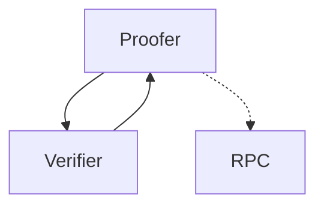
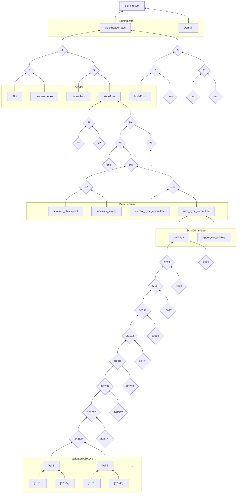

# C4 (corpus core colibri client)


[](https://github.com/corpus-core/c4/actions/workflows/cmake-multi-platform.yml)
## Index

- [Index](#index)
- [Concept](#concept)
    - [Updating the sync committee](#updating-the-sync-committee)
    - [Merkle Proofs](#merkle-proofs)
        - [Patricia Merkle Proof](#patricia-merkle-proof)
        - [SSZ Merkle Proof](#ssz-merkle-proof)
- [RPC Proofs](#rpc-proofs)
    - [eth_getBalance](#eth_getbalance)
    - [eth_getCode](#eth_getcode)
    - [eth_getNonce](#eth_getnonce)
    - [eth_getProof](#eth_getproof)
    - [eth_getStorageAt](#eth_getstorageat)
    - [eth_getTransactionByHash](#eth_gettransactionbyhash)
    - [eth_getTransactionByBlockHashAndIndex](#eth_gettransactionbyblockhashandindex)
- [Building](#building)
    - [CMake Options](#cmake-options)
- [SSZ Types](#ssz-types)
    - [Attestation](#attestation)
    - [AttestationData](#attestationdata)
    - [AttesterSlashing](#attesterslashing)
    - [BeaconBlock](#beaconblock)
    - [BeaconBlockBody](#beaconblockbody)
    - [BeaconBlockHeader](#beaconblockheader)
    - [BlockHashProof](#blockhashproof)
    - [BlsToExecutionChange](#blstoexecutionchange)
    - [C4Request](#c4request)
    - [Checkpoint](#checkpoint)
    - [Deposit](#deposit)
    - [DepositData](#depositdata)
    - [Eth1Data](#eth1data)
    - [EthAccountProof](#ethaccountproof)
    - [EthStateProof](#ethstateproof)
    - [EthStorageProof](#ethstorageproof)
    - [EthTransactionProof](#ethtransactionproof)
    - [ExecutionPayload](#executionpayload)
    - [ExecutionPayloadHeader](#executionpayloadheader)
    - [ForkData](#forkdata)
    - [IndexAttestation](#indexattestation)
    - [LightClientHeader](#lightclientheader)
    - [LightClientUpdate](#lightclientupdate)
    - [ProposerSlashing](#proposerslashing)
    - [SignedBeaconBlock](#signedbeaconblock)
    - [SignedBeaconBlockheader](#signedbeaconblockheader)
    - [SignedBlsToExecutionChange](#signedblstoexecutionchange)
    - [SignedVoluntaryExit](#signedvoluntaryexit)
    - [SigningData](#signingdata)
    - [SyncAggregate](#syncaggregate)
    - [SyncCommittee](#synccommittee)
    - [SyncState](#syncstate)
    - [VoluntaryExit](#voluntaryexit)
    - [Withdrawal](#withdrawal)
- [License](#license)


## Concept



The idea behind C4 is to create a ultra light client or better verifier which can be used in Websites, Mobile applications, but especially in embedded systems. The Proofer is a library which can used within you mobile app or in the backend to create Proof that the given data is valid. The Verifier is a library which can be used within the embedded system to verify this Proof.

The verifier itself is almost stateless and only needs to store the state of the sync committee, which changes every 27h. But with the latest sync committee the verifier is able to verify any proof with the signatures matching the previously verified public keys of the sync committee.
This allows independent Verification and security on any devices without the need to process every blockheader (as light clients usually would do).

### Updating the sync committee
 
A Sync Committee holds 512 validators signing every block. Every 27h the validators are updated. Since the verifier is passive, it will not activly sync. So whenever a proof is presented requiring a newer sync committee than the last state, it will tell it as part of the response to the proofer. The Proofer will then fetch the LightClientUpdates from any Beacon Chain API and push them to the verifier along with the Proof-Request. The verifier will then verify the LightClientUpdates and update the sync committee stored.

The Data in the [LightClientUpdate](#lightclientupdate) is used to verify the transition between two periods of the SyncCommittee. This is done oin 2 Steps:

1. calculate the SigningRoot by calculating the hash_tree_root of the new validator pubkeys and following the merkle proof down to the blockBodyRoot hash adn finally the SigningRoot
2. verify the BLS signature against the Signing Root as message and the aggregated pubkey of the old sync committee 

The following diagram shows the Structure of the Merkle Tree leading to the SigningRoot:



In order to validate, we need to calculate
- 512 x sha256 for each pubkey 
- 512 x sha256 merkle proof for the pubkeys
- 2 x sha256 for the SyncCommittee
- 5 x sha256 for the stateRoot
- 3 x sha256 for the blockheader hash
- 1 x for the SigningRoot

So in total, we need to verify 1035 hashes and 1 bls signature.

### Merkle Proofs

The Proofs contain different types of Merkle Proofs.

#### Patricia Merkle Proof

The [Patricia Merkle Proof](https://github.com/corpus-core/c4/blob/main/src/util/ssz_merkle.c#L100) is a proof for a single leaf and used in the execution layer of ethereum for states of accounts and storage, transaction receipts and more. This is what you get when calling eth_getProof.

#### SSZ Merkle Proof

This Merkle trees are used withn the beacon chain. The Structure is based on the defition of the SSZ Types and allows to proof individual properties. 
Another feature is the option to [proof multiple leafs](https://ethereum.org/de/developers/docs/data-structures-and-encoding/ssz/#multiproofs) at once which is used in different types of proofs in the c4 client.

All ssz proofs for single or multiple leafs are following the same structure:

- Only required node (32 bytess each) are added.
- The nodes are alwayys sorted by their [generalized index](https://ethereum.org/de/developers/docs/data-structures-and-encoding/ssz/#generalized-index) starting with highest number.

WHile a merkle proof for a single proof has always the same fixed size (which is equal to its depth), the size of a multi proof depends on the number of leafs and their position within the tree.
So in order to verify a multi proof, we first need to figure out which nodes ( represented by ther generalized index) are required. For example a multi proof for a small tree with 4 leafes, would end up with as empty list if you actually request all 4 leafes because there would be no nodes left to proof.

```c
  // define a small tree with 3 leafes
  ssz_def_t TEST_SUB[] = {
      SSZ_UINT8("a"),
      SSZ_UINT8("b"),
      SSZ_UINT8("c"),
  };

  ssz_def_t TEST_ROOT[] = {
      SSZ_UINT8("count"),
      SSZ_CONTAINER("sub", TEST_SUB),
  };

  ssz_def_t TEST_TYPE_CONTAINER = SSZ_CONTAINER("TEST_ROOT", TEST_ROOT);

  // create a container with the defined ssz type
  uint8_t   ssz_data[]          = {1, 2, 3, 4}; // serialized data of the container
  ssz_ob_t  val                 = ssz_ob(TEST_TYPE_CONTAINER, bytes(ssz_data, 4));

  // create a multi proof the properties count,  a and b
  bytes_t multi_proof = ssz_create_multi_proof(res, 3,
                            ssz_gindex(res.def, 1, "count"),
                            ssz_gindex(res.def, 2, "sub", "a"),
                            ssz_gindex(res.def, 2, "sub", "b")
                       );

 // this proof has only one witness

 // verify the proof
 // create a leafes array for the required leafes
  uint8_t leafes[96] = {0};
  leafes[0]          = 1; // count = 1
  leafes[32]         = 2; // a = 2
  leafes[64]         = 3; // b = 3

  // define the gindexes of the required lproperties
  gindex_t gindexes[] = {
    ssz_gindex(res.def, 1, "count"),
    ssz_gindex(res.def, 2, "sub", "a"),
    ssz_gindex(res.def, 2, "sub", "b")};

  // verify the proof and store the calculated root hash in proofed_root
  bytes32_t proofed_root = {0};
  ssz_verify_multi_merkle_proof(multi_proof, bytes(leafes, sizeof(leafes)), gindexes, proofed_root);

  // now the root contains the root hash, which you can compare with the hash_tree_root of the container
  bytes32_t root = {0};
  ssz_hash_tree_root(val, root);

  // assert
  TEST_ASSERT_EQUAL_UINT8_ARRAY_MESSAGE(root, proofed_root, 32, "root hash must be the same after merkle proof");

```


## RPC Proofs

All requests send to the verifier are encoded using SSZ. The request itself is sepcified by the [C4Request](#c4request) type. This objects suports different types as data or proofs.

In order to proof the RPC-Request, the  proofer will use different proofs.

### eth_getBalance

- Data: Bytes32
- Proof: [EthAccountProof](#ethaccountproof)

### eth_getCode

- Data: Bytes
- Proof: [EthAccountProof](#ethaccountproof)

### eth_getNonce

- Data: Bytes32
- Proof: [EthAccountProof](#ethaccountproof)

### eth_getProof

not implemented yet

### eth_getStorageAt

not implemented yet

### eth_getTransactionByHash

- Data: [EthTransactionData](#ethtransactiondata)
- Proof: [EthTransactionProof](#ethtransactionproof)

### eth_getTransactionByBlockHashAndIndex


- Data: [EthTransactionData](#ethtransactiondata)
- Proof: [EthTransactionProof](#ethtransactionproof)


## Building


```sh
#clone
git clone https://github.com/colibri-labs/c4.git
cd c4

#build
mkdir build
cd build
cmake -DCMAKE_BUILD_TYPE=Debug ..
make

#run 
bin/verify ../test/data/proof_data.ssz

```

### CMake Options

- **-DCLI**: generates the CLI tools.  
    Default: ON  
    Usage: `cmake -DCLI=ON` ..

- **-DCMAKE_BUILD_TYPE**: Build type  
    Default: Release  
    Options: Debug, Release, RelWithDebInfo, MinSizeRel  
    Usage: `cmake -DCMAKE_BUILD_TYPE=Release` ..

- **-DCOVERAGE**: if true the coverage will be build  
    Default: OFF  
    Usage: `cmake -DCOVERAGE=OFF` ..

- **-DCURL**: if true curl will be used as transport  
    Default: ON  
    Usage: `cmake -DCURL=ON` ..

- **-DFILE_STORAGE**: if activated the verfifier will use a simple file-implementaion to store states in the current folder or in a folder specified by the env varC4_STATE_DIR  
    Default: ON  
    Usage: `cmake -DFILE_STORAGE=ON` ..

- **-DMESSAGES**: if activated the binaries will contain error messages, but for embedded systems this is not needed and can be turned off to save memory  
    Default: ON  
    Usage: `cmake -DMESSAGES=ON` ..

- **-DPRECOMPILE_ZERO_HASHES**: if activated zero hashes are cached which costs up to 1kb in RAM, but are needed in order to calc BeaconBodys in the proofer, but not in the verfier  
    Default: ON  
    Usage: `cmake -DPRECOMPILE_ZERO_HASHES=ON` ..

- **-DSHAREDLIB**: if true the shared library will be build  
    Default: OFF  
    Usage: `cmake -DSHAREDLIB=OFF` ..

- **-DTEST**: if true the test will be build  
    Default: OFF  
    Usage: `cmake -DTEST=OFF` ..


## SSZ Types

### Attestation


 The Type is defined in [proofer/ssz_types.c](https://github.com/corpus-core/c4/blob/main/src/proofer/ssz_types.c#L60).

```python
class Attestation(Container):
    aggregationBits: BitList [2048]
    data           : AttestationData
    signature      : ByteVector [96]
```

### AttestationData


 The Type is defined in [proofer/ssz_types.c](https://github.com/corpus-core/c4/blob/main/src/proofer/ssz_types.c#L22).

```python
class AttestationData(Container):
    slot           : Uint64
    index          : Uint64
    beaconBlockRoot: Bytes32
    source         : Checkpoint
    target         : Checkpoint
```

### AttesterSlashing


 The Type is defined in [proofer/ssz_types.c](https://github.com/corpus-core/c4/blob/main/src/proofer/ssz_types.c#L49).

```python
class AttesterSlashing(Container):
    signedHeader1: IndexAttestation
    signedHeader2: IndexAttestation
```

### BeaconBlock


 The Type is defined in [proofer/ssz_types.c](https://github.com/corpus-core/c4/blob/main/src/proofer/ssz_types.c#L153).

```python
class BeaconBlock(Container):
    slot         : Uint64    # the slot of the block or blocknumber
    proposerIndex: Uint64    # the index of the validator proposing the block
    parentRoot   : Bytes32   # the hash_tree_root of the parent block header
    stateRoot    : Bytes32   # the hash_tree_root of the state at the end of the block
    body         : BeaconBlockBody
```

### BeaconBlockBody

const ssz_def_t ssz_bls_pubky[] = {


 The Type is defined in [proofer/ssz_types.c](https://github.com/corpus-core/c4/blob/main/src/proofer/ssz_types.c#L138).

```python
class BeaconBlockBody(Container):
    randaoReveal         : ByteVector [96]
    eth1Data             : Eth1Data
    graffiti             : Bytes32
    proposerSlashings    : List [ProposerSlashing, MAX_PROPOSER_SLASHINGS]
    attesterSlashings    : List [AttesterSlashing, MAX_ATTESTER_SLASHINGS]
    attestations         : List [Attestation, MAX_ATTESTATIONS]
    deposits             : List [Deposit, MAX_DEPOSITS]
    voluntaryExits       : List [SignedVoluntaryExit, MAX_VOLUNTARY_EXITS]
    syncAggregate        : SyncAggregate
    executionPayload     : ExecutionPayload
    blsToExecutionChanges: List [SignedBlsToExecutionChange, MAX_BLS_TO_EXECUTION_CHANGES]
    blobKzgCommitments   : List [blsPubky, 4096]
```

### BeaconBlockHeader

the header of a beacon block


 The Type is defined in [verifier/types_beacon.c](https://github.com/corpus-core/c4/blob/main/src/verifier/types_beacon.c#L8).

```python
class BeaconBlockHeader(Container):
    slot         : Uint64    # the slot of the block or blocknumber
    proposerIndex: Uint64    # the index of the validator proposing the block
    parentRoot   : Bytes32   # the hash_tree_root of the parent block header
    stateRoot    : Bytes32   # the hash_tree_root of the state at the end of the block
    bodyRoot     : Bytes32   # the hash_tree_root of the block body
```

### BlockHashProof

the block hash proof is used as part of different other types since it contains all relevant
 proofs to validate the blockhash of the execution layer


 The Type is defined in [verifier/types_verify.c](https://github.com/corpus-core/c4/blob/main/src/verifier/types_verify.c#L12).

```python
class BlockHashProof(Container):
    blockhash_proof         : List [bytes32, 256]   # the merkle prooof from the executionPayload.blockhash down to the blockBodyRoot hash
    header                  : BeaconBlockHeader     # the header of the beacon block
    sync_committee_bits     : BitVector [512]       # the bits of the validators that signed the block
    sync_committee_signature: ByteVector [96]       # the signature of the sync committee
```

### BlsToExecutionChange


 The Type is defined in [proofer/ssz_types.c](https://github.com/corpus-core/c4/blob/main/src/proofer/ssz_types.c#L118).

```python
class BlsToExecutionChange(Container):
    validatorIndex    : Uint64
    fromBlsPubkey     : ByteVector [48]
    toExecutionAddress: Address
```

### C4Request

the main container defining the incoming data processed by the verifier


 The Type is defined in [verifier/types_verify.c](https://github.com/corpus-core/c4/blob/main/src/verifier/types_verify.c#L153).

```python
class C4Request(Container):
    data     : Union[                 # the data to proof
        None,
        Bytes32                       # the blochash  which is used for blockhash proof,
        Bytes32                       # the balance of an account
    ]
    proof    : Union[                 # the proof of the data
        None,
        BlockHashProof,
        EthAccountProof               # the blockhash proof used validating blockhashes
    ]
    sync_data: Union[                 # the sync data containing proofs for the transition between the two periods
        None,
        List [LightClientUpdate, 512] # this light client update can be fetched directly from the beacon chain API
    ]
```

### Checkpoint


 The Type is defined in [proofer/ssz_types.c](https://github.com/corpus-core/c4/blob/main/src/proofer/ssz_types.c#L18).

```python
class Checkpoint(Container):
    epoch: Uint64
    root : Bytes32
```

### Deposit


 The Type is defined in [proofer/ssz_types.c](https://github.com/corpus-core/c4/blob/main/src/proofer/ssz_types.c#L74).

```python
class Deposit(Container):
    proof: Vector [bytes32, 33]
    data : DepositData
```

### DepositData


 The Type is defined in [proofer/ssz_types.c](https://github.com/corpus-core/c4/blob/main/src/proofer/ssz_types.c#L67).

```python
class DepositData(Container):
    pubkey               : ByteVector [48]
    withdrawalCredentials: Bytes32
    amount               : Uint64
    signature            : ByteVector [96]
```

### Eth1Data


 The Type is defined in [proofer/ssz_types.c](https://github.com/corpus-core/c4/blob/main/src/proofer/ssz_types.c#L54).

```python
class Eth1Data(Container):
    depositRoot : Bytes32
    depositCount: Uint64
    blockHash   : Bytes32
```

### EthAccountProof

1. **Patricia Merkle Proof** for the Account Object in the execution layer (balance, nonce, codeHash, storageHash) and the storage values with its own Proofs. (using eth_getProof): Result StateRoot
 2. **State Proof** is a SSZ Merkle Proof from the StateRoot to the ExecutionPayload over the BeaconBlockBody to its root hash which is part of the header.
 3. **BeaconBlockHeader** is passed because also need the slot in order to find out which period and which sync committee is used.
 4. **Signature of the SyncCommittee** (taken from the following block) is used to verify the SignData where the blockhash is part of the message and the Domain is calculated from the fork and the Genesis Validator Root.
 ```mermaid
 flowchart TB
     subgraph "ExecutionLayer"
         class ExecutionLayer transparent
         subgraph "Account"
             balance --> account
             nonce --> account
             codeHash --> account
             storageHash --> account
         end
         subgraph "Storage"
             key1 --..PM..-->storageHash
             key2 --..PM..-->storageHash
             key3 --..PM..-->storageHash
         end
     end
     subgraph "ConsensusLayer"
         subgraph "ExecutionPayload"
             account --..PM..--> stateRoot
         end
         subgraph "BeaconBlockBody"
             stateRoot --SSZ D:5--> executionPayload
             m[".."]
         end
         subgraph "BeaconBlockHeader"
             slot
             proposerIndex
             parentRoot
             s[stateRoot]
             executionPayload  --SSZ D:4--> bodyRoot
         end
     end
 ```


 The Type is defined in [verifier/types_verify.c](https://github.com/corpus-core/c4/blob/main/src/verifier/types_verify.c#L123).

```python
class EthAccountProof(Container):
    accountProof: List [bytes_1024, 256]        # Patricia merkle proof
    address     : Address                       # the address of the account
    balance     : Bytes32                       # the balance of the account
    codeHash    : Bytes32                       # the code hash of the account
    nonce       : Bytes32                       # the nonce of the account
    storageHash : Bytes32                       # the storage hash of the account
    storageProof: List [EthStorageProof, 256]   # the storage proofs of the selected
    state_proof : EthStateProof                 # the state proof of the account
```

### EthStateProof

the stateRoot proof is used as part of different other types since it contains all relevant
 proofs to validate the stateRoot of the execution layer


 The Type is defined in [verifier/types_verify.c](https://github.com/corpus-core/c4/blob/main/src/verifier/types_verify.c#L20).

```python
class EthStateProof(Container):
    state_proof             : List [bytes32, 256]   # the merkle prooof from the executionPayload.state down to the blockBodyRoot hash
    header                  : BeaconBlockHeader     # the header of the beacon block
    sync_committee_bits     : BitVector [512]       # the bits of the validators that signed the block
    sync_committee_signature: ByteVector [96]       # the signature of the sync committee
```

### EthStorageProof

represents the storage proof of a key


 The Type is defined in [verifier/types_verify.c](https://github.com/corpus-core/c4/blob/main/src/verifier/types_verify.c#L29).

```python
class EthStorageProof(Container):
    key  : Bytes32                # the key to be proven
    proof: List [bytes_1024, 5]   # Patricia merkle proof
    value: Bytes32
```

### EthTransactionProof

const ssz_def_t ssz_transactions_bytes      = SSZ_BYTES("Bytes", 1073741824);
 represents the account and storage values, including the Merkle proof, of the specified account.
 1. The **payload of the transaction** is used to create its SSZ Hash Tree Root.
 2. The **SSZ Merkle Proof** from the Transactions of the ExecutionPayload to the BlockBodyRoot. (Total Depth: 29)
 3. **BeaconBlockHeader** is passed because also need the slot in order to find out which period and which sync committee is used.
 4. **Signature of the SyncCommittee** (taken from the following block) is used to verify the SignData where the blockhash is part of the message and the Domain is calculated from the fork and the Genesis Validator Root.
 ```mermaid
 flowchart TB
     subgraph "ExecutionPayload"
         transactions
         blockNumber
         blockHash
     end
     TX --SSZ D:21--> transactions
     subgraph "BeaconBlockBody"
         transactions  --SSZ D:5--> executionPayload
         blockNumber --SSZ D:5--> executionPayload
         blockHash --SSZ D:5--> executionPayload
         m[".."]
     end
     subgraph "BeaconBlockHeader"
         slot
         proposerIndex
         parentRoot
         s[stateRoot]
         executionPayload  --SSZ D:4--> bodyRoot
     end
 ```


 The Type is defined in [verifier/types_verify.c](https://github.com/corpus-core/c4/blob/main/src/verifier/types_verify.c#L67).

```python
class EthTransactionProof(Container):
    transaction             : Bytes[1073741824]    # the raw transaction payload
    transactionIndex        : Uint32               # the index of the transaction in the block
    blockNumber             : Uint64               # the number of the execution block containing the transaction
    blockHash               : Uint64               # the blockHash of the execution block containing the transaction
    proof                   : List [bytes32, 64]   # the multi proof of the transaction, blockNumber and blockHash
    header                  : BeaconBlockHeader    # the header of the beacon block
    sync_committee_bits     : BitVector [512]      # the bits of the validators that signed the block
    sync_committee_signature: ByteVector [96]      # the signature of the sync committee
```

### ExecutionPayload

the block header of the execution layer proved within the beacon block


 The Type is defined in [proofer/ssz_types.c](https://github.com/corpus-core/c4/blob/main/src/proofer/ssz_types.c#L99).

```python
class ExecutionPayload(Container):
    parentHash   : Bytes32                             # the hash of the parent block
    feeRecipient : Address                             # the address of the fee recipient
    stateRoot    : Bytes32                             # the merkle root of the state at the end of the block
    receiptsRoot : Bytes32                             # the merkle root of the transactionreceipts
    logsBloom    : ByteVector [256]                    # the bloom filter of the logs
    prevRandao   : Bytes32                             # the randao of the previous block
    blockNumber  : Uint64                              # the block number
    gasLimit     : Uint64                              # the gas limit of the block
    gasUsed      : Uint64                              # the gas used of the block
    timestamp    : Uint64                              # the timestamp of the block
    extraData    : Bytes[32]                           # the extra data of the block
    baseFeePerGas: Uint256                             # the base fee per gas of the block
    blockHash    : Bytes32                             # the hash of the block
    transactions : List [transactionsBytes, 1048576]   # the list of transactions
    withdrawals  : List [Withdrawal, 16]               # the list of withdrawels
    blobGasUsed  : Uint64                              # the gas used for the blob transactions
    excessBlobGas: Uint64                              # the excess blob gas of the block
```

### ExecutionPayloadHeader

the block header of the execution layer proved within the beacon block


 The Type is defined in [verifier/types_beacon.c](https://github.com/corpus-core/c4/blob/main/src/verifier/types_beacon.c#L23).

```python
class ExecutionPayloadHeader(Container):
    parentHash      : Bytes32            # the hash of the parent block
    feeRecipient    : Address            # the address of the fee recipient
    stateRoot       : Bytes32            # the merkle root of the state at the end of the block
    receiptsRoot    : Bytes32            # the merkle root of the transactionreceipts
    logsBloom       : ByteVector [256]   # the bloom filter of the logs
    prevRandao      : Bytes32            # the randao of the previous block
    blockNumber     : Uint64             # the block number
    gasLimit        : Uint64             # the gas limit of the block
    gasUsed         : Uint64             # the gas used of the block
    timestamp       : Uint64             # the timestamp of the block
    extraData       : Bytes[32]          # the extra data of the block
    baseFeePerGas   : Uint256            # the base fee per gas of the block
    blockHash       : Bytes32            # the hash of the block
    transactionsRoot: Bytes32            # the merkle root of the transactions
    withdrawalsRoot : Bytes32            # the merkle root of the withdrawals
    blobGasUsed     : Uint64             # the gas used for the blob transactions
    excessBlobGas   : Uint64             # the excess blob gas of the block
```

### ForkData

the fork data is used to create the domain


 The Type is defined in [verifier/verify_blockhash_proof.c](https://github.com/corpus-core/c4/blob/main/src/verifier/verify_blockhash_proof.c#L27).

```python
class ForkData(Container):
    version: ByteVector [4]   # the version of the fork
    state  : Bytes32          # the state of the Genisis Block
```

### IndexAttestation


 The Type is defined in [proofer/ssz_types.c](https://github.com/corpus-core/c4/blob/main/src/proofer/ssz_types.c#L32).

```python
class IndexAttestation(Container):
    attestingIndices: List [uint8, 2048]
    data            : AttestationData
    signature       : ByteVector [96]
```

### LightClientHeader

the header of the light client update


 The Type is defined in [verifier/types_beacon.c](https://github.com/corpus-core/c4/blob/main/src/verifier/types_beacon.c#L48).

```python
class LightClientHeader(Container):
    beacon         : BeaconBlockHeader        # the header of the beacon block
    execution      : ExecutionPayloadHeader   # the header of the execution layer proved within the beacon block
    executionBranch: Vector [bytes32, 4]      # the merkle proof of the execution layer proved within the beacon block
```

### LightClientUpdate

the light client update is used to verify the transition between two periods of the SyncCommittee.
 This data will be fetched directly through the beacon Chain API since it contains all required data.


 The Type is defined in [verifier/types_beacon.c](https://github.com/corpus-core/c4/blob/main/src/verifier/types_beacon.c#L55).

```python
class LightClientUpdate(Container):
    attestedHeader         : LightClientHeader     # the header of the beacon block attested by the sync committee
    nextSyncCommittee      : SyncCommittee
    nextSyncCommitteeBranch: Vector [bytes32, 5]   # will be 6 in electra
    finalizedHeader        : LightClientHeader     # the header of the finalized beacon block
    finalityBranch         : Vector [bytes32, 6]   # will be 7 in electra
    syncAggregate          : SyncAggregate         # the aggregates signature of the sync committee
    signatureSlot          : Uint64                # the slot of the signature
```

### ProposerSlashing


 The Type is defined in [proofer/ssz_types.c](https://github.com/corpus-core/c4/blob/main/src/proofer/ssz_types.c#L44).

```python
class ProposerSlashing(Container):
    signedHeader1: SignedBeaconBlockheader
    signedHeader2: SignedBeaconBlockheader
```

### SignedBeaconBlock


 The Type is defined in [proofer/ssz_types.c](https://github.com/corpus-core/c4/blob/main/src/proofer/ssz_types.c#L160).

```python
class SignedBeaconBlock(Container):
    message  : BeaconBlock
    signature: ByteVector [96]
```

### SignedBeaconBlockheader


 The Type is defined in [proofer/ssz_types.c](https://github.com/corpus-core/c4/blob/main/src/proofer/ssz_types.c#L40).

```python
class SignedBeaconBlockheader(Container):
    message  : BeaconBlockHeader
    signature: ByteVector [96]
```

### SignedBlsToExecutionChange


 The Type is defined in [proofer/ssz_types.c](https://github.com/corpus-core/c4/blob/main/src/proofer/ssz_types.c#L124).

```python
class SignedBlsToExecutionChange(Container):
    message  : BlsToExecutionChange
    signature: ByteVector [96]
```

### SignedVoluntaryExit


 The Type is defined in [proofer/ssz_types.c](https://github.com/corpus-core/c4/blob/main/src/proofer/ssz_types.c#L84).

```python
class SignedVoluntaryExit(Container):
    message  : VoluntaryExit
    signature: ByteVector [96]
```

### SigningData

combining the root with a domain to ensure uniqueness of the signing message


 The Type is defined in [verifier/verify_blockhash_proof.c](https://github.com/corpus-core/c4/blob/main/src/verifier/verify_blockhash_proof.c#L20).

```python
class SigningData(Container):
    root  : Bytes32   # the hashed root of the data to sign
    domain: Bytes32   # the domain of the data to sign
```

### SyncAggregate

the aggregates signature of the sync committee


 The Type is defined in [verifier/types_beacon.c](https://github.com/corpus-core/c4/blob/main/src/verifier/types_beacon.c#L43).

```python
class SyncAggregate(Container):
    syncCommitteeBits     : BitVector [512]   # the bits of the validators that signed the block (each bit represents a validator)
    syncCommitteeSignature: ByteVector [96]   # the signature of the sync committee
```

### SyncCommittee

the public keys sync committee used within a period ( about 27h)


 The Type is defined in [verifier/types_beacon.c](https://github.com/corpus-core/c4/blob/main/src/verifier/types_beacon.c#L18).

```python
class SyncCommittee(Container):
    pubkeys        : Vector [blsPubky, 512]   # the 512 pubkeys (each 48 bytes) of the validators in the sync committee
    aggregatePubkey: ByteVector [48]          # the aggregate pubkey (48 bytes) of the sync committee
```

### SyncState

the sync state of the sync committee. This is used to store the verfied validators as state within the verifier.


 The Type is defined in [verifier/sync_committee.c](https://github.com/corpus-core/c4/blob/main/src/verifier/sync_committee.c#L15).

```python
class SyncState(Container):
    validators: Vector [blsPubky, 512]   # the list of the validators
    period    : Uint32                   # the period of the sync committee
```

### VoluntaryExit


 The Type is defined in [proofer/ssz_types.c](https://github.com/corpus-core/c4/blob/main/src/proofer/ssz_types.c#L79).

```python
class VoluntaryExit(Container):
    epoch         : Uint64
    validatorIndex: Uint64
```

### Withdrawal


 The Type is defined in [proofer/ssz_types.c](https://github.com/corpus-core/c4/blob/main/src/proofer/ssz_types.c#L89).

```python
class Withdrawal(Container):
    index         : Uint64
    validatorIndex: Uint64
    address       : Address
    amount        : Uint64
```
## License

MIT