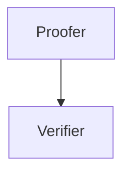

# C4 (corpus core colibri client)

C4 is a ultra light (almost) stateless client or verifier.

The idea of C4 is to create a verifier, which can validate Proofs in order to make sure all the blockchain data you wan to preocess are correct.
C4 is written in C so it can be used even on embedded systems.

The minimal set up would be a proofer to create proofs and verifier to validate them.




## Building


```sh
#clone
git clone https://github.com/colibri-labs/c4.git
cd c4

#build
mkdir build
cd build
cmake -DCMAKE_BUILD_TYPE=Debug ..
make

#run 
bin/verify ../test/data/proof_data.ssz

```

## SSZ Types

### BeaconBlockHeader

the header of a beacon block

```python
class BeaconBlockHeader(Container):
    slot: Uint64   # the slot of the block or blocknumber
    proposerIndex: Uint64   # the index of the validator proposing the block
    parentRoot: Bytes32   # the hash_tree_root of the parent block header
    stateRoot: Bytes32   # the hash_tree_root of the state at the end of the block
    bodyRoot: Bytes32   # the hash_tree_root of the block body
```

### SyncCommittee

the public keys sync committee used within a period ( about 27h)

```python
class SyncCommittee(Container):
    pubkeys: Vector [blsPubky, 512]   # the 512 pubkeys (each 48 bytes) of the validators in the sync committee
    aggregatePubkey: ByteVector   # the aggregate pubkey (48 bytes) of the sync committee
```

### ExecutionPayloadHeader

the block header of the execution layer proved within the beacon block

```python
class ExecutionPayloadHeader(Container):
    parentHash: Bytes32   # the hash of the parent block
    feeRecipient: Address   # the address of the fee recipient
    stateRoot: Bytes32   # the merkle root of the state at the end of the block
    receiptsRoot: Bytes32   # the merkle root of the transactionreceipts
    logsBloom: ByteVector   # the bloom filter of the logs
    prevRandao: Bytes32   # the randao of the previous block
    blockNumber: Uint64   # the block number
    gasLimit: Uint64   # the gas limit of the block
    gasUsed: Uint64   # the gas used of the block
    timestamp: Uint64   # the timestamp of the block
    extraData: Bytes   # the extra data of the block
    baseFeePerGas: Uint256   # the base fee per gas of the block
    blockHash: Bytes32   # the hash of the block
    transactionsRoot: Bytes32   # the merkle root of the transactions
    withdrawalsRoot: Bytes32   # the merkle root of the withdrawals
    blobGasUsed: Uint64   # the gas used for the blob transactions
    excessBlobGas: Uint64   # the excess blob gas of the block
```

### SyncAggregate

the aggregates signature of the sync committee

```python
class SyncAggregate(Container):
    syncCommitteeBits: BitVector [512]   # the bits of the validators that signed the block (each bit represents a validator)
    syncCommitteeSignature: ByteVector   # the signature of the sync committee
```

### LightClientHeader

the header of the light client update

```python
class LightClientHeader(Container):
    beacon: BeaconBlockHeader   # the header of the beacon block
    execution: ExecutionPayloadHeader   # the header of the execution layer proved within the beacon block
    executionBranch: Vector [bytes32, 4]   # the merkle proof of the execution layer proved within the beacon block
```

### LightClientUpdate

the light client update is used to verify the transition between two periods of the SyncCommittee.
 This data will be fetched directly through the beacon Chain API since it contains all required data.

```python
class LightClientUpdate(Container):
    attestedHeader: LightClientHeader   # the header of the beacon block attested by the sync committee
    nextSyncCommittee: SyncCommittee
    nextSyncCommitteeBranch: Vector [bytes32, 5]   # will be 6 in electra
    finalizedHeader: LightClientHeader   # the header of the finalized beacon block
    finalityBranch: Vector [bytes32, 6]   # will be 7 in electra
    syncAggregate: SyncAggregate   # the aggregates signature of the sync committee
    signatureSlot: Uint64   # the slot of the signature
```

### BlockHashProof

the block hash proof is used as part of different other types since it contains all relevant
 proofs to validate the blockhash of the execution layer

```python
class BlockHashProof(Container):
    blockhash_proof: List [bytes32, 256]   # the merkle prooof from the executionPayload.blockhash down to the blockBodyRoot hash
    header: BeaconBlockHeader   # the header of the beacon block
    sync_committee_bits: BitVector [512]   # the bits of the validators that signed the block
    sync_committee_signature: ByteVector   # the signature of the sync committee
```

### Union C4RequestData

A List of possible types of data matching the Proofs

```python
C4RequestData = Union [ None , Bytes32]
```

### Union C4RequestProofs

A List of possible types of proofs matching the Data

```python
C4RequestProofs = Union [ None , BlockHashProof]
```

### Union C4RequestSyncdata

A List of possible types of sync data used to update the sync state by verifying the transition from the last period to the required.

```python
C4RequestSyncdata = Union [ None , List [LightClientUpdate, 512]]
```

### C4Request

the main container defining the incoming data processed by the verifier

```python
class C4Request(Container):
    data: C4RequestData <union>    # the data to proof
    proof: C4RequestProofs <union>    # the proof of the data
    sync_data: C4RequestSyncdata <union>    # the sync data containing proofs for the transition between the two periods
```

### SyncState

the sync state of the sync committee. This is used to store the verfied validators as state within the verifier.

```python
class SyncState(Container):
    validators: Vector [blsPubky, 512]   # the list of the validators
    period: Uint32   # the period of the sync committee
```
## License

MIT