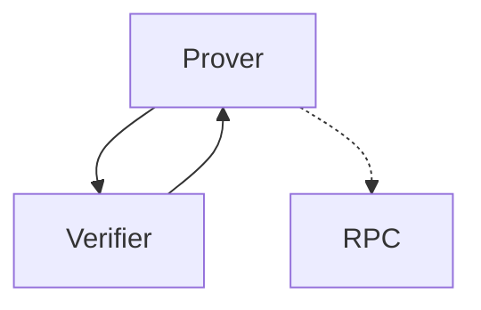

# Colibri Stateless


Colibri Stateless is a highly efficient prover/verifier for Ethereum and upcoming support for various Layer-2 solutions and other blockchains. The core library is written in C and provides bindings for JavaScript/TypeScript, Swift, Kotlin/Java, and Python.

## Overview



Colibri Stateless enables the creation of an ultra-light client or verifier that can be used in websites, mobile applications, and especially in embedded systems. The prover creates cryptographic proofs for the validity of blockchain data, while the verifier validates these proofs - almost statelessly.

The verifier only needs to store the state of the sync committee, which changes every 27 hours. With the current sync committee, it can verify any proof with the corresponding BLS signatures without having to process every block header.

## Quickstart

### Clone and Build

```bash
# Clone the repository
git clone https://github.com/corpus-core/colibri-stateless.git
cd colibri-stateless

# Create build directory
mkdir build && cd build

# Configure with CMake and build
cmake -DCMAKE_BUILD_TYPE=Release -DTEST=true ..
make -j4

# Test
make test
```

Usage:

```bash
bin/verify -i https://mainnet1.colibri-proof.tech eth_blockNumber
```

📖 [**Full CLI Documentation**](https://corpus-core.gitbook.io/specification-colibri-stateless/developer-guide/bindings/cli)

### Bindings

#### JavaScript/TypeScript

```bash
npm install @corpus-core/colibri-stateless
```

**Hello World:**
```typescript
import Colibri from "@corpus-core/colibri-stateless";

const client = new Colibri({prover:['https://mainnet.colibri-proof.tech']});
const block = await client.request('eth_getBlockByNumber', ['latest', false]);
console.log("Latest block:", block.number);
```

📖 [**Full JavaScript/TypeScript Documentation**](https://corpus-core.gitbook.io/specification-colibri-stateless/developer-guide/bindings/javascript-typescript)

#### Kotlin/Java

**Installation via GitHub Packages:**

```kotlin
// Add to your build.gradle.kts
repositories {
    maven {
        url = uri("https://maven.pkg.github.com/corpus-core/colibri-stateless")
    }
}

dependencies {
    // For JVM/Server (JAR with Linux, macOS, Windows natives)
    implementation("com.corpuscore:colibri-jar:1.0.0")
    
    // For Android (AAR with all Android ABIs)
    implementation("com.corpuscore:colibri-aar:1.0.0")
}
```

**Hello World:**
```kotlin
import com.corpuscore.colibri.Colibri

val client = Colibri()
val result = client.rpc("eth_blockNumber", arrayOf())
val blockNumber = String(result).removePrefix("0x").toLong(16)
println("Current block: #$blockNumber")
```

📦 [**GitHub Packages**](https://github.com/corpus-core/colibri-stateless/packages) | 📖 [**Full Kotlin/Java Documentation**](https://corpus-core.gitbook.io/specification-colibri-stateless/developer-guide/bindings/kotlin-java)

#### Swift

```swift
// Add to Package.swift
dependencies: [
    .package(url: "https://github.com/corpus-core/colibri-stateless-swift.git", from: "1.0.0")
]
```

**Hello World:**
```swift
// In your iOS app
import Colibri

let colibri = Colibri()
colibri.chainId = 1  // Ethereum Mainnet
colibri.provers = ["https://c4.incubed.net"]

// RPC call with automatic proof verification
let result = try await colibri.rpc(method: "eth_getBalance", params: [
    "0x742d35Cc6434C532532532532532532535C0ddd",
    "latest"
])

if let balance = result as? String {
    print("Account balance: \(balance)")
}
```

📖 [**Full Swift Documentation**](https://corpus-core.gitbook.io/specification-colibri-stateless/developer-guide/bindings/swift)

#### Python

```bash
pip install colibri-stateless
```

**Hello World:**
```python
from colibri import Colibri

client = Colibri()
block_number = client.request('eth_blockNumber', [])
print(f"Current block: {block_number}")
```

📖 [**Full Python Documentation**](https://corpus-core.gitbook.io/specification-colibri-stateless/developer-guide/bindings/python)

#### Docker / Prover Server

Run your own prover server using Docker:

```bash
# Pull from GitHub Container Registry
docker pull ghcr.io/corpus-core/colibri-prover:latest

# Run with Docker
docker run -p 8090:8090 ghcr.io/corpus-core/colibri-prover:latest

# Or use Docker Compose with Memcached (recommended)
# See bindings/docker/README.md for full configuration
```

**Available tags:**
- `latest` - Latest stable release (linux/amd64, linux/arm64)
- `main` - Main branch (linux/amd64)
- `dev` - Development branch (linux/amd64)
- `vX.Y.Z` - Specific versions

The prover server is lightweight (single-threaded, ~100MB internal cache) and benefits greatly from Memcached for caching external requests (24h TTL).

[**Full Docker Documentation**](bindings/docker/README.md) |  [**GitHub Container Registry**](https://github.com/corpus-core/colibri-stateless/pkgs/container/colibri-prover)

## Documentation

Complete documentation with detailed specifications, API references, and examples can be found at:

**📖 [Colibri Stateless Specification](https://corpus-core.gitbook.io/specification-colibri-stateless)**

The documentation includes:
- Detailed architecture and concepts
- Complete API reference
- Supported RPC methods
- SSZ type definitions
- Developer guides for all bindings
- Examples and best practices

## License

This project (everything _except_ `src/server/`) is licensed under the MIT License. See [LICENSE](LICENSE) for details.

**Server component** (`src/server/`) is dual-licensed:

- **PolyForm Noncommercial License 1.0.0**  
  Free for non-commercial use only. See [src/server/LICENSE.POLYFORM](src/server/LICENSE.POLYFORM) or the official text at [polyformproject.org/licenses/noncommercial/1.0.0](https://polyformproject.org/licenses/noncommercial/1.0.0/).

- **Commercial License**  
  Required for any commercial or revenue-generating use of the server. Please contact [jork@corpus.io](mailto:jork@corpus.io) to arrange an individual license agreement.
