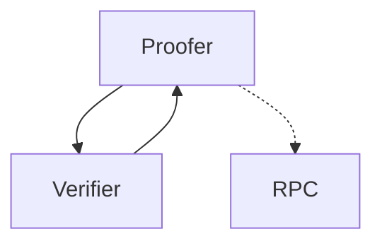

# C4 (corpus core colibri client)


## Index

- [Index](#index)
- [Concept](#concept)
    - [Updating the sync committee](#updating-the-sync-committee)
    - [Proof Requests](#proof-requests)
- [Building](#building)
    - [CMake Options](#cmake-options)
- [SSZ Types](#ssz-types)
    - [BeaconBlockHeader](#beaconblockheader)
    - [BlockHashProof](#blockhashproof)
    - [C4Request](#c4request)
    - [ExecutionPayloadHeader](#executionpayloadheader)
    - [LightClientHeader](#lightclientheader)
    - [LightClientUpdate](#lightclientupdate)
    - [SyncAggregate](#syncaggregate)
    - [SyncCommittee](#synccommittee)
    - [SyncState](#syncstate)
- [License](#license)


## Concept



The idea behind C4 is to create a ultra light client or better verifier which can be used in Websites, Mobile applications, but especially in embedded systems. The Proofer is a library which can used within you mobile app or in the backend to create Proof that the given data is valid. The Verifier is a library which can be used within the embedded system to verify this Proof.

The verifier itself is almost stateless and only needs to store the state of the sync committee, which changes every 27h. But with the latest sync committee the verifier is able to verify any proof with the signatures matching the previously verified public keys of the sync committee.
This allows independent Verification and security on any devices without the need to process every blockheader (as light clients usually would do).

### Updating the sync committee
 
A Sync Committee holds 512 validators signing every block. Every 27h the validators are updated. Since the verifier is passive, it will not activly sync. So whenever a proof is presented requiring a newer sync committee than the last state, it will tell it as part of the response to the proofer. The Proofer will then fetch the LightClientUpdates from any Beacon Chain API and push them to the verifier along with the Proof-Request. The verifier will then verify the LightClientUpdates and update the sync committee stored.

### Proof Requests

All requests send to the verifier are encoded using SSZ. The request itself is sepcified by the [C4Request](#c4request) type. This objects suports different types as data or proofs.

## Building


```sh
#clone
git clone https://github.com/colibri-labs/c4.git
cd c4

#build
mkdir build
cd build
cmake -DCMAKE_BUILD_TYPE=Debug ..
make

#run 
bin/verify ../test/data/proof_data.ssz

```

### CMake Options

- **-DCLI**: generates the CLI tools.  
    Default: ON  
    Usage: `cmake -DCLI=ON` ..

- **-DCMAKE_BUILD_TYPE**: Build type  
    Default: Release  
    Options: Debug, Release, RelWithDebInfo, MinSizeRel  
    Usage: `cmake -DCMAKE_BUILD_TYPE=Release` ..

- **-DMESSAGES**: if activated the binaries will contain error messages, but for embedded systems this is not needed and can be turned off to save memory  
    Default: ON  
    Usage: `cmake -DMESSAGES=ON` ..


## SSZ Types

### BeaconBlockHeader

the header of a beacon block


 The Type is defined in [verifier/types_beacon.c](https://github.com/corpus-core/c4/blob/main/src/verifier/types_beacon.c#L8).

```python
class BeaconBlockHeader(Container):
    slot         : Uint64    # the slot of the block or blocknumber
    proposerIndex: Uint64    # the index of the validator proposing the block
    parentRoot   : Bytes32   # the hash_tree_root of the parent block header
    stateRoot    : Bytes32   # the hash_tree_root of the state at the end of the block
    bodyRoot     : Bytes32   # the hash_tree_root of the block body
```

### BlockHashProof

the block hash proof is used as part of different other types since it contains all relevant
 proofs to validate the blockhash of the execution layer


 The Type is defined in [verifier/types_verify.c](https://github.com/corpus-core/c4/blob/main/src/verifier/types_verify.c#L10).

```python
class BlockHashProof(Container):
    blockhash_proof         : List [bytes32, 256]   # the merkle prooof from the executionPayload.blockhash down to the blockBodyRoot hash
    header                  : BeaconBlockHeader     # the header of the beacon block
    sync_committee_bits     : BitVector [512]       # the bits of the validators that signed the block
    sync_committee_signature: ByteVector [96]       # the signature of the sync committee
```

### C4Request

the main container defining the incoming data processed by the verifier


 The Type is defined in [verifier/types_verify.c](https://github.com/corpus-core/c4/blob/main/src/verifier/types_verify.c#L34).

```python
class C4Request(Container):
    data     : Union[                 # the data to proof
        None,
        Bytes32                       # the blochash  which is used for blockhash proof
    ]
    proof    : Union[                 # the proof of the data
        None,
        BlockHashProof                # the blockhash proof used validating blockhashes
    ]
    sync_data: Union[                 # the sync data containing proofs for the transition between the two periods
        None,
        List [LightClientUpdate, 512] # this light client update can be fetched directly from the beacon chain API
    ]
```

### ExecutionPayloadHeader

the block header of the execution layer proved within the beacon block


 The Type is defined in [verifier/types_beacon.c](https://github.com/corpus-core/c4/blob/main/src/verifier/types_beacon.c#L21).

```python
class ExecutionPayloadHeader(Container):
    parentHash      : Bytes32            # the hash of the parent block
    feeRecipient    : Address            # the address of the fee recipient
    stateRoot       : Bytes32            # the merkle root of the state at the end of the block
    receiptsRoot    : Bytes32            # the merkle root of the transactionreceipts
    logsBloom       : ByteVector [256]   # the bloom filter of the logs
    prevRandao      : Bytes32            # the randao of the previous block
    blockNumber     : Uint64             # the block number
    gasLimit        : Uint64             # the gas limit of the block
    gasUsed         : Uint64             # the gas used of the block
    timestamp       : Uint64             # the timestamp of the block
    extraData       : Bytes[32]          # the extra data of the block
    baseFeePerGas   : Uint256            # the base fee per gas of the block
    blockHash       : Bytes32            # the hash of the block
    transactionsRoot: Bytes32            # the merkle root of the transactions
    withdrawalsRoot : Bytes32            # the merkle root of the withdrawals
    blobGasUsed     : Uint64             # the gas used for the blob transactions
    excessBlobGas   : Uint64             # the excess blob gas of the block
```

### LightClientHeader

the header of the light client update


 The Type is defined in [verifier/types_beacon.c](https://github.com/corpus-core/c4/blob/main/src/verifier/types_beacon.c#L46).

```python
class LightClientHeader(Container):
    beacon         : BeaconBlockHeader        # the header of the beacon block
    execution      : ExecutionPayloadHeader   # the header of the execution layer proved within the beacon block
    executionBranch: Vector [bytes32, 4]      # the merkle proof of the execution layer proved within the beacon block
```

### LightClientUpdate

the light client update is used to verify the transition between two periods of the SyncCommittee.
 This data will be fetched directly through the beacon Chain API since it contains all required data.


 The Type is defined in [verifier/types_beacon.c](https://github.com/corpus-core/c4/blob/main/src/verifier/types_beacon.c#L53).

```python
class LightClientUpdate(Container):
    attestedHeader         : LightClientHeader     # the header of the beacon block attested by the sync committee
    nextSyncCommittee      : SyncCommittee
    nextSyncCommitteeBranch: Vector [bytes32, 5]   # will be 6 in electra
    finalizedHeader        : LightClientHeader     # the header of the finalized beacon block
    finalityBranch         : Vector [bytes32, 6]   # will be 7 in electra
    syncAggregate          : SyncAggregate         # the aggregates signature of the sync committee
    signatureSlot          : Uint64                # the slot of the signature
```

### SyncAggregate

the aggregates signature of the sync committee


 The Type is defined in [verifier/types_beacon.c](https://github.com/corpus-core/c4/blob/main/src/verifier/types_beacon.c#L41).

```python
class SyncAggregate(Container):
    syncCommitteeBits     : BitVector [512]   # the bits of the validators that signed the block (each bit represents a validator)
    syncCommitteeSignature: ByteVector [96]   # the signature of the sync committee
```

### SyncCommittee

the public keys sync committee used within a period ( about 27h)


 The Type is defined in [verifier/types_beacon.c](https://github.com/corpus-core/c4/blob/main/src/verifier/types_beacon.c#L16).

```python
class SyncCommittee(Container):
    pubkeys        : Vector [blsPubky, 512]   # the 512 pubkeys (each 48 bytes) of the validators in the sync committee
    aggregatePubkey: ByteVector [48]          # the aggregate pubkey (48 bytes) of the sync committee
```

### SyncState

the sync state of the sync committee. This is used to store the verfied validators as state within the verifier.


 The Type is defined in [verifier/sync_committee.c](https://github.com/corpus-core/c4/blob/main/src/verifier/sync_committee.c#L10).

```python
class SyncState(Container):
    validators: Vector [blsPubky, 512]   # the list of the validators
    period    : Uint32                   # the period of the sync committee
```
## License

MIT