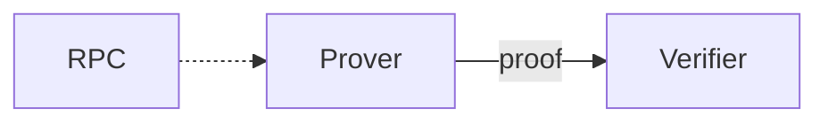

# Colibri Stateless

**Verify Ethereum RPC data cryptographically — without running a full node.**

Colibri Stateless is a highly efficient prover/verifier for Ethereum (with upcoming support for Layer-2s such as OP-Stack). The core is written in portable C and ships with bindings for JavaScript/TypeScript, Swift, Kotlin/Java, Python, Dart, and Rust — small enough to run in browsers, mobile apps, and embedded devices.


[](https://www.npmjs.com/package/@corpus-core/colibri-stateless)

[**Website**](https://www.corpuscore.tech/colibri) · [**Docs**](https://corpus-core.gitbook.io/specification-colibri-stateless) · [**Whitepaper**](https://corpus-core.gitbook.io/whitepaper-colibri-stateless) · [**Privacy (PAP)**](https://corpus-core.gitbook.io/pap-colibri-stateless)


```mermaid
flowchart LR
    P[Prover] -->|proof| V[Verifier]
    RPC -.-> P
```

## Why Colibri?

- **Stateless** — verification needs nothing but the proof and the sync committee it is checked against. The sync committee is cached locally so it does not have to travel with every request, but it works just as well with an empty cache or none at all. No persistent state, no block-by-block header processing, no full node.
- **Cryptographically verified RPC** — the prover creates proofs for the validity of RPC responses; the verifier checks them against BLS signatures.
- **Offline verification** — a proof is fully self-contained and can be verified without any network connection. A phone can hand a complete event proof to an offline device — e.g. a smart lock over Bluetooth — which then verifies it locally. This is made possible by zk-proofs for the sync committee and signed checkpoints.
- **Flexible trust bootstrap** — initialize either from a checkpoint (the classic light-client bootstrap) or from a zk-proof that recursively proves every sync-committee transition back to the trusted root.
- **On-demand, not always-on** — Colibri only does work when you actually make a request. It does not continuously sync in the background, so it never burns bandwidth, CPU, or battery while your app is idle (see [How is Colibri different?](#how-is-colibri-different-from-other-light-clients) below).
- **Verifies historical data (older than ~27h / 8192 blocks)** — a unique capability: using `historical_summaries` Merkle proofs from the beacon state, Colibri cleanly verifies old transactions and receipts where other light clients simply fail.
- **`eth_getLogs` completeness proofs** — cryptographic guarantee that for a requested block range no matching event was omitted ([PR #318](https://github.com/corpus-core/colibri-stateless/pull/318)). No other light client offers this today.
- **Fully verified local transaction simulation** — `colibri_simulateTransaction` lets wallets simulate a transaction against verified state *before signing*, so users can be shown exactly what a transaction will do.
- **Tiny & fast** — a portable C core for websites, mobile apps, and embedded systems. Most requests are barely slower than a plain RPC call — see the [benchmarks](https://corpus-core.gitbook.io/specification-colibri-stateless/specifications/ethereum/benchmark).
- **Multi-chain** — Ethereum today, Layer-2s (OP-Stack) and more coming.
- **Bindings everywhere** — JavaScript/TypeScript, Swift, Kotlin/Java, Python, Dart, and Rust.
- **Privacy-aware** — Pragmatic Adaptive Privacy (PAP) mode. See the [Privacy Whitepaper](https://corpus-core.gitbook.io/pap-colibri-stateless).

## How is Colibri different from other light clients?

Classic light clients (e.g. Helios) keep a **continuous sync** running: they follow the chain and fetch every block header, even while your app sits in the background — which costs bandwidth, CPU, and battery. Colibri takes the opposite, **request-driven** approach:

| | Continuous light client | **Colibri Stateless** |
|---|---|---|
| **When it works** | Continuously syncs every block | Only when you make a request |
| **Idle cost** | Ongoing bandwidth / CPU / battery | Zero — nothing runs in the background |
| **State kept** | Follows the head over time | None required — sync committee is cached or delivered |
| **Offline verification** | Needs a live connection | Yes — proofs are self-contained |
| **Historical data (> ~27h)** | Typically fails / not supported | Yes — verified via `historical_summaries` proofs |
| **`eth_getLogs` completeness** | Not proven | Yes — cryptographic completeness proof |
| **Footprint** | Larger runtime | Tiny C core, embeddable |

Each Colibri result is a self-contained, cryptographically verifiable proof — so it fits naturally into wallets, dApps, mobile, and embedded devices that can't afford an always-on sync loop.

## Quickstart (JavaScript / TypeScript)

The JS/TS binding is the fastest way to try Colibri — it works in Node.js and the browser.

```bash
npm install @corpus-core/colibri-stateless
```

```typescript
import Colibri from "@corpus-core/colibri-stateless";

const client = new Colibri({ prover: ['https://mainnet.colibri-proof.tech'] });

// RPC call with automatic proof generation + verification
const block = await client.request('eth_getBlockByNumber', ['latest', false]);
console.log("Latest block:", block.number);
```

[**Full JavaScript/TypeScript Documentation**](https://corpus-core.gitbook.io/specification-colibri-stateless/developer-guide/bindings/javascript-typescript)

## Other Bindings

Colibri exposes the same core through several language bindings. Pick yours below.

<details>
<summary><b>Swift</b> (iOS / macOS)</summary>

```swift
// Add to Package.swift
dependencies: [
    .package(url: "https://github.com/corpus-core/colibri-stateless-swift.git", from: "1.0.0")
]
```

```swift
import Colibri

let colibri = Colibri()
colibri.chainId = 1  // Ethereum Mainnet
colibri.provers = ["https://mainnet.colibri-proof.tech"]

let result = try await colibri.rpc(method: "eth_getBalance", params: [
    "0x742d35Cc6434C532532532532532532535C0ddd",
    "latest"
])
print("Account balance:", result as? String ?? "n/a")
```

[**Full Swift Documentation**](https://corpus-core.gitbook.io/specification-colibri-stateless/developer-guide/bindings/swift)

</details>

<details>
<summary><b>Kotlin / Java</b> (JVM / Android)</summary>

```kotlin
// build.gradle.kts
repositories {
    maven { url = uri("https://maven.pkg.github.com/corpus-core/colibri-stateless") }
}

dependencies {
    // JVM/Server (JAR with Linux, macOS, Windows natives)
    implementation("com.corpuscore:colibri-jar:1.0.0")
    // Android (AAR with all Android ABIs)
    implementation("com.corpuscore:colibri-aar:1.0.0")
}
```

```kotlin
import com.corpuscore.colibri.Colibri

val client = Colibri()
val result = client.rpc("eth_blockNumber", arrayOf())
val blockNumber = String(result).removePrefix("0x").toLong(16)
println("Current block: #$blockNumber")
```

[**GitHub Packages**](https://github.com/corpus-core/colibri-stateless/packages) · [**Full Kotlin/Java Documentation**](https://corpus-core.gitbook.io/specification-colibri-stateless/developer-guide/bindings/kotlin-java)

</details>

<details>
<summary><b>Python</b></summary>

```bash
pip install colibri-stateless
```

```python
from colibri import Colibri

client = Colibri()
block_number = client.request('eth_blockNumber', [])
print(f"Current block: {block_number}")
```

[**Full Python Documentation**](https://corpus-core.gitbook.io/specification-colibri-stateless/developer-guide/bindings/python)

</details>

<details>
<summary><b>Dart / Flutter</b></summary>

#### Dart / Flutter

For Flutter apps (Android, iOS, macOS, Linux) with **bundled native binaries** (**Colibri v2**, `0.2.x`):

```yaml
dependencies:
  colibri_flutter: ^0.2.1
```

```dart
import 'package:colibri_flutter/colibri_flutter.dart';

final colibri = Colibri(chainId: 1, libraryPath: colibriFlutterLibraryPath);
final blockNumber = await colibri.rpc('eth_blockNumber', []);
colibri.close();
```

[**Full Dart Documentation**](https://corpus-core.gitbook.io/specification-colibri-stateless/developer-guide/bindings/dart) · [**Flutter Plugin Documentation**](bindings/dart/flutter/colibri_flutter/README.md) · [**pub.dev**](https://pub.dev/packages/colibri_flutter)

</details>

<details>
<summary><b>Rust</b></summary>

```toml
# Cargo.toml
[dependencies]
colibri-stateless = "0.1"
tokio = { version = "1", features = ["rt-multi-thread", "macros"] }
```

```rust
use colibri_stateless::Colibri;

#[tokio::main]
async fn main() -> anyhow::Result<()> {
    let client = Colibri::builder(1)
        .provers(vec!["https://mainnet.colibri-proof.tech".into()])
        .build();

    let block = client.rpc("eth_blockNumber", &[]).await?;
    println!("current block = {block}");
    Ok(())
}
```

[**crates.io**](https://crates.io/crates/colibri-stateless) · [**Full Rust Documentation**](https://corpus-core.gitbook.io/specification-colibri-stateless/developer-guide/bindings/rust)

</details>

> **More languages coming:** **Go** and **C#** are planned.

<details>
<summary><b>CLI</b></summary>

```bash
# Clone and build
git clone https://github.com/corpus-core/colibri-stateless.git
cd colibri-stateless
cmake --preset default
cmake --build build/default

# Verify a request against a prover
build/default/bin/verify -i https://mainnet1.colibri-proof.tech eth_blockNumber
```

[**Full CLI Documentation**](https://corpus-core.gitbook.io/specification-colibri-stateless/developer-guide/bindings/cli)

</details>

<details>
<summary><b>Docker / Prover Server</b> (run your own prover)</summary>

```bash
# Pull from GitHub Container Registry
docker pull ghcr.io/corpus-core/colibri-prover:latest

# Run
docker run -p 8090:8090 ghcr.io/corpus-core/colibri-prover:latest

# Or use Docker Compose with Memcached (recommended)
# See bindings/docker/README.md for full configuration
```

**Available tags:** `latest` (linux/amd64, linux/arm64), `main`, `dev`, `vX.Y.Z`.

The prover server is lightweight (single-threaded, ~100MB internal cache) and benefits greatly from Memcached for caching external requests (24h TTL).

[**Full Docker Documentation**](bindings/docker/README.md) · [**GitHub Container Registry**](https://github.com/corpus-core/colibri-stateless/pkgs/container/colibri-prover)

</details>

## Documentation & Links

| | |
|---|---|
| **Product website** | [corpuscore.tech/colibri](https://www.corpuscore.tech/colibri) |
| **Whitepaper** | [General whitepaper](https://corpus-core.gitbook.io/whitepaper-colibri-stateless) |
| **Privacy concept (PAP)** | [Privacy whitepaper](https://corpus-core.gitbook.io/pap-colibri-stateless) |
| **Specification & developer docs** | [Colibri Stateless Specification](https://corpus-core.gitbook.io/specification-colibri-stateless) |

The specification covers architecture and concepts, the complete API reference, supported RPC methods, SSZ type definitions, developer guides for all bindings, and the [threat model](https://corpus-core.gitbook.io/specification-colibri-stateless/specifications/ethereum/threat-model).

## License

This project (everything _except_ `src/server/`) is licensed under the MIT License. See [LICENSE](LICENSE) for details.

**Server component** (`src/server/`) is dual-licensed:

- **PolyForm Noncommercial License 1.0.0**  
  Free for non-commercial use only. See [src/server/LICENSE.POLYFORM](src/server/LICENSE.POLYFORM) or the official text at [polyformproject.org/licenses/noncommercial/1.0.0](https://polyformproject.org/licenses/noncommercial/1.0.0/).

- **Commercial License**  
  Required for any commercial or revenue-generating use of the server. Please contact [jork@corpus.io](mailto:jork@corpus.io) to arrange an individual license agreement.
