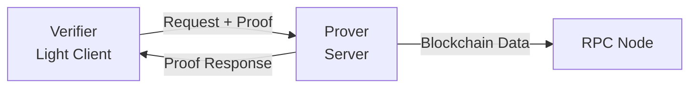

# Colibri Prover - Docker Image


This Docker image provides the **Colibri Prover Server**, the backend component of the Colibri Stateless ecosystem. It generates cryptographic proofs for blockchain data that can be verified by ultra-light clients.

## Quick Start

### Pull from GitHub Container Registry

```bash
# Latest release
docker pull ghcr.io/corpus-core/colibri-prover:latest

# Development version
docker pull ghcr.io/corpus-core/colibri-prover:dev

# Main branch
docker pull ghcr.io/corpus-core/colibri-prover:main

# Specific version
docker pull ghcr.io/corpus-core/colibri-prover:v1.0.0
```

### Run the Server

```bash
docker run -p 8090:8090 ghcr.io/corpus-core/colibri-prover:latest
```

The server will be available at `http://localhost:8090`.

## Available Tags

| Tag | Description | Platform | Update Frequency |
|-----|-------------|----------|------------------|
| `latest` | Latest stable release | amd64, arm64 | On version release |
| `vX.Y.Z` | Specific version (e.g., v1.0.0) | amd64, arm64 | Fixed version |
| `main` | Latest from main branch | amd64 | On every commit to main |
| `dev` | Development version | amd64 | On every commit to dev |

**Recommendation:** Use `latest` or a specific version tag (e.g., `v1.0.0`) for production deployments.

### Docker Compose

**Production setup with Memcached (recommended):**
```yaml
version: '3.8'

services:
  colibri-prover:
    image: ghcr.io/corpus-core/colibri-prover:latest
    pull_policy: always
    container_name: colibri_prover
    restart: unless-stopped
    init: true
    stop_signal: SIGTERM
    stop_grace_period: 120s
    ports:
      - "8090:8090"
    environment:
      - PORT=8090
      - CHAIN_ID=1
      - MEMCACHED_HOST=memcached
      - BEACON_EVENTS=true  # Proactively cache new blocks for fast 'latest' queries
      - RPC=https://eth-mainnet.g.alchemy.com/v2/YOUR_API_KEY,https://ethereum-rpc.publicnode.com
      - BEACON=https://lodestar-mainnet.chainsafe.io/
    healthcheck:
      test: ["CMD-SHELL", "curl -fsS http://127.0.0.1:$${PORT}/health || exit 1"]
      interval: 30s
      timeout: 5s
      retries: 3
      start_period: 60s
    depends_on:
      memcached:
        condition: service_healthy

  memcached:
    image: memcached:alpine
    container_name: memcached_prover
    restart: unless-stopped
    command: memcached -m 2048  # Limit memory to 2GB (adjust based on your needs)
    healthcheck:
      test: ["CMD", "sh", "-c", "echo stats | nc 127.0.0.1 11211"]
      interval: 10s
      timeout: 5s
      retries: 5
      start_period: 5s
```

**Memcached memory configuration:**
- `-m 512` → 512 MB (minimal setup)
- `-m 1024` → 1 GB (small-medium load)
- `-m 2048` → 2 GB (recommended for production)
- `-m 4096` → 4 GB (high-traffic environments)

Save this as `docker-compose.yml` and run:

```bash
docker compose up -d
```

**Note:** Using Memcached is **highly recommended** for production. The prover server caches almost all external requests in Memcached (TTL: 24h), which significantly reduces load on RPC/Beacon endpoints and improves response times.

### Performance Tips

For optimal performance in production:

1. **Enable Memcached** - Caches all external requests (24h TTL)
2. **Enable Beacon Events** (`BEACON_EVENTS=true`) - Proactively caches new blocks as they arrive
3. **Configure Memcached memory** - At least 2GB for production (`-m 2048`)
4. **Use multiple RPC/Beacon endpoints** - For redundancy and load balancing

**Result:** With this setup, `'latest'` queries are served from cache with minimal latency, and the server can handle high request volumes efficiently.

## Architecture

Colibri Stateless consists of two components:

- **Prover (this image)** - Backend server that generates cryptographic proofs
- **Verifier** - Ultra-light client that verifies proofs (available as bindings for JS/TS, Swift, Kotlin, Python)



The verifier can be integrated into:
- ✅ Web applications (JavaScript/TypeScript)
- ✅ Mobile apps (Swift, Kotlin)
- ✅ Desktop applications (Python)
- ✅ Embedded systems

## Features

- ✅ Ethereum Mainnet support
- ✅ Layer-2 support (Optimism, and more coming)
- ✅ Efficient proof generation with Merkle proofs
- ✅ BLS signature aggregation
- ✅ Sync committee proof support
- ✅ Lightweight single-threaded architecture (libuv)
- ✅ Built-in caching (~100MB internal cache)
- ✅ External caching via Memcached (recommended, 24h TTL)
- ✅ Stateless verification model

## Resource Requirements

The prover server itself is **lightweight** (uses libuv, single-threaded, ~100MB internal cache). Most load comes from fetching data and building Merkle proofs.

**For the Prover Server:**
- CPU: 1-2 cores
- RAM: 512 MB - 1 GB
- Storage: 1-5 GB (for data directory)

**For Memcached (recommended, caches external requests with 24h TTL):**
- RAM: 1-4 GB (configurable, see examples below)

**Recommended total for production setup (Prover + Memcached):**
- CPU: 2 cores
- RAM: 2-4 GB
- Storage: 10-20 GB

## Building Locally

If you want to build the image yourself:

```bash
docker build -t colibri-prover -f bindings/docker/Dockerfile .
```

## Multi-Architecture Support

Multi-platform images (both architectures) are **only available for releases**:
- `latest` - Latest stable release (linux/amd64, linux/arm64)
- `vX.Y.Z` - Version tags like v1.0.0 (linux/amd64, linux/arm64)

Development and main branch builds use single platform for faster builds:
- `main` - Main branch (linux/amd64 only)
- `dev` - Development branch (linux/amd64 only)

Docker will automatically pull the correct image for your platform. For production use, we recommend using a specific release tag to get multi-architecture support.

## Configuration

The server can be configured via:
- **Command-line flags:** `--port 8090` or `-p 8090`
- **Environment variables:** `PORT=8090` (recommended for Docker Compose)

### Key Configuration Options

| Option | Flag | Environment Variable | Default | Description |
|--------|------|---------------------|---------|-------------|
| Port | `-p, --port` | `PORT` | `8090` | Port to listen on |
| Chain ID | `-c, --chain_id` | `CHAIN_ID` | `1` | Chain ID (1=Mainnet, 10=Optimism) |
| Log Level | `-l, --log_level` | `LOG_LEVEL` | `0` | Log verbosity (0-3) |
| RPC Endpoints | `-r, --rpc` | `RPC` | (defaults) | Ethereum RPC (comma-separated) |
| Beacon Nodes | `-b, --beacon` | `BEACON` | (defaults) | Beacon nodes (comma-separated) |
| Data Directory | `-d, --data` | `DATA` | - | Data directory for caching |
| Memcached Host | `-m, --memcached_host` | `MEMCACHED_HOST` | `localhost` | Memcached hostname (highly recommended!) |
| Memcached Port | `-P, --memcached_port` | `MEMCACHED_PORT` | `11211` | Memcached port |
| Beacon Events | `-e, --beacon_events` | `BEACON_EVENTS` | `false` | Enable proactive caching via beacon event streaming (recommended for production) |

**Important caching notes:**

- **Memcached:** Almost all external requests are cached with a 24h TTL, dramatically reducing load on RPC/Beacon endpoints and improving response times.

- **Beacon Events (`BEACON_EVENTS=true`):** When enabled, the server proactively caches new blocks as soon as the Beacon API reports them. This means requests with `'latest'` get extremely fast responses from cache instead of fetching data on-demand. **Highly recommended for production!**

### Example with Custom Configuration (CLI)

```bash
docker run -p 8090:8090 \
  -v $(pwd)/data:/data \
  ghcr.io/corpus-core/colibri-prover:latest \
  /app/server \
    --port 8090 \
    --chain_id 1 \
    --log_level 2 \
    --rpc https://eth-mainnet.g.alchemy.com/v2/YOUR_API_KEY
```

### Example with Environment Variables

```bash
docker run -p 8090:8090 \
  -v $(pwd)/data:/data \
  -e PORT=8090 \
  -e CHAIN_ID=1 \
  -e RPC=https://eth-mainnet.g.alchemy.com/v2/YOUR_API_KEY \
  ghcr.io/corpus-core/colibri-prover:latest
```

Refer to the [main documentation](https://corpus-core.gitbook.io/specification-colibri-stateless) or run `--help` for all options.

## License

### ⚠️ Important License Information

This Docker image contains the **Colibri Prover Server**, which is licensed under a **dual-license model**:

**For Non-Commercial Use: PolyForm Noncommercial License 1.0.0**

- ✅ **Free for:**
  - Personal projects and research
  - Academic and educational use
  - Testing and evaluation
  - Non-profit organizations
  - Open source projects (non-revenue generating)

- ❌ **NOT allowed without commercial license:**
  - Commercial production use
  - Revenue-generating services
  - Enterprise deployments

**For Commercial Use: Commercial License Required**

If you plan to use this prover server for any commercial or revenue-generating purposes, you must obtain a commercial license.

📧 **Contact for commercial licensing:** [jork@corpus.io](mailto:jork@corpus.io)

**License Details:**
- License file: [src/server/LICENSE.POLYFORM](../../src/server/LICENSE.POLYFORM)
- Official text: [polyformproject.org/licenses/noncommercial/1.0.0](https://polyformproject.org/licenses/noncommercial/1.0.0/)

**Note:** The rest of the Colibri Stateless project (verifier library and bindings) is MIT-licensed and free for commercial use.

### Security

This image is built from source using GitHub Actions with:
- Regular security updates
- Minimal base image (Debian Bookworm Slim)
- No unnecessary dependencies
- Multi-stage build for smaller attack surface

## Use Cases

### For Verifier Developers

Use this prover server to provide proof data to your light client applications:

```typescript
// JavaScript/TypeScript Example
import Colibri from "@corpus-core/colibri-stateless";

const client = new Colibri({
  prover: ['http://your-prover-server:8090']
});

const block = await client.request('eth_getBlockByNumber', ['latest', false]);
console.log("Latest block:", block.number);
```

### For Infrastructure Providers

Run your own prover infrastructure to:
- Provide verified blockchain data to applications
- Reduce dependency on centralized RPC providers
- Enable trustless light client operations

## Related Packages

- **JavaScript/TypeScript:** [@corpus-core/colibri-stateless](https://www.npmjs.com/package/@corpus-core/colibri-stateless)
- **Python:** [colibri-stateless](https://pypi.org/project/colibri-stateless/)
- **Swift:** [Swift Package](https://github.com/corpus-core/colibri-stateless)
- **Kotlin/Java:** [Maven Central](https://central.sonatype.com/artifact/io.corpus.colibri/colibri-stateless)

## Documentation & Support

- **Full Documentation:** [corpus-core.gitbook.io/specification-colibri-stateless](https://corpus-core.gitbook.io/specification-colibri-stateless)
- **Source Code:** [github.com/corpus-core/colibri-stateless](https://github.com/corpus-core/colibri-stateless)
- **Issues & Support:** [GitHub Issues](https://github.com/corpus-core/colibri-stateless/issues)

---

**Built by [Corpus Core](https://corpus.io)**

