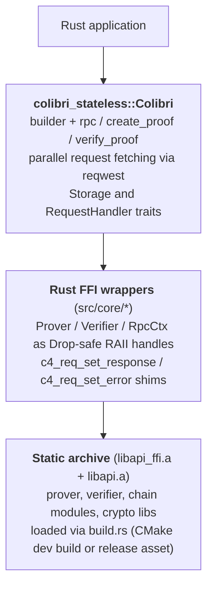

: Bindings

:: Rust

Rust bindings for the Colibri stateless prover/verifier. Ergonomic
`async/await` API on top of the shared C core, so you can generate and
cryptographically verify Ethereum / OP-Stack RPC responses from Rust
without trusting any centralised infrastructure.

## Overview

The `colibri-stateless` crate wraps the same C library that powers the
Dart, Python, Kotlin, Swift and Emscripten bindings. It exposes:

- A high-level [`Colibri`] client with a fluent builder, driven over
  the **Unified RPC API** (`c4_create_rpc_ctx` / `c4_rpc_execute_json_status`).
- Low-level [`Prover`] and [`Verifier`] wrappers for hosts that want to
  drive the JSON status protocol themselves.
- A pluggable [`Storage`] trait plus in-memory / file-system defaults.
- A [`RequestHandler`] trait so hosts can plug their own HTTP stack.
- File-backed mocks in [`colibri_stateless::testing`][testing] that
  replay the shared `test/data/*` fixtures used by every other binding.

### Core features

- **Cryptographic verification** -- every RPC response is validated
  against Merkle / SSZ proofs.
- **Async/await** -- built on `tokio` with an internal `reqwest`
  transport (rustls) that fetches pending requests in parallel on
  native targets. On `wasm*` targets the transport is omitted and
  hosts supply their own via [`RequestHandler`].
- **Zero-copy FFI** -- thin `unsafe` shim around the C API; all Rust
  types are `Send`.
- **Hybrid distribution** -- in a local checkout the crate builds the
  native library via CMake, in published crates it downloads a
  prebuilt static archive from the matching GitHub Release.
- **WebAssembly (WASI Preview 1)** -- the crate compiles for
  `wasm32-wasip1` via the [wasi-sdk][wasi-sdk] toolchain; see
  [WebAssembly (wasm32-wasip1)](#webassembly-wasm32-wasip1) below.
- **Shared test corpus** -- the same fixtures under `test/data/*`
  power the Rust integration tests too.

[wasi-sdk]: https://github.com/WebAssembly/wasi-sdk

## Architecture



## Installation

Add the crate to your `Cargo.toml`:

```toml
[dependencies]
colibri-stateless = "0.1"
tokio = { version = "1", features = ["rt-multi-thread", "macros"] }
```

Pre-built native archives are published as GitHub Release assets and
downloaded automatically by `build.rs` for the following targets:

- **Linux** (`x86_64-unknown-linux-gnu`)
- **macOS** (`aarch64-apple-darwin`, `x86_64-apple-darwin`)
- **Windows** (`x86_64-pc-windows-msvc`)
- **WebAssembly** (`wasm32-wasip1`, WASI Preview 1 -- see
  [WebAssembly (wasm32-wasip1)](#webassembly-wasm32-wasip1))

For unsupported targets or when you already have locally-built
static libraries, set `COLIBRI_LIB_DIR` before `cargo build`. Every
static archive found in that directory is linked (works both for a
single combined `libc4.a` and the multi-archive release layout):

```bash
export COLIBRI_LIB_DIR=/path/to/dir/with/static/archives
cargo build --release
```

### Development installation (from the monorepo)

Inside the `colibri-stateless` repository the crate builds the native
library from source using CMake:

```bash
git clone https://github.com/corpus-core/colibri-stateless
cd colibri-stateless/bindings/rust
cargo build --release
cargo test  --release
```

`build.rs` invokes CMake with `-DCLI=OFF -DHTTP_SERVER=OFF
-DCURL=OFF` and then links every static archive under
`target/.../build/default/src/` into the crate. No extra scripts
required.

## Quick start

### Verified RPC call (remote prover)

```rust
use colibri_stateless::Colibri;

#[tokio::main]
async fn main() -> anyhow::Result<()> {
    let client = Colibri::builder(1)
        .provers(vec!["https://mainnet.colibri-proof.tech".into()])
        .build();

    let block: serde_json::Value = client.rpc("eth_blockNumber", &[]).await?;
    println!("current block = {}", block);
    Ok(())
}
```

### Local proof generation

```rust
use colibri_stateless::Colibri;
use serde_json::json;

#[tokio::main]
async fn main() -> anyhow::Result<()> {
    let client = Colibri::builder(1)
        // empty provers list = local proof generation
        .provers(Vec::<String>::new())
        .eth_rpcs(vec!["https://eth.llamarpc.com".into()])
        .beacon_apis(vec!["https://lodestar-mainnet.chainsafe.io".into()])
        .build();

    let balance = client
        .rpc(
            "eth_getBalance",
            &json!(["0x95222290DD7278Aa3Ddd389Cc1E1d165CC4BAfe5", "latest"]),
        )
        .await?;

    println!("balance = {balance}");
    Ok(())
}
```

## API reference

### `Colibri` builder

```rust
use colibri_stateless::{Colibri, PrivacyMode, ProverMode};

let client = Colibri::builder(1)
    // Remote proof generation (fastest, still verified locally).
    .provers(vec!["https://mainnet.colibri-proof.tech".into()])

    // Optional local sources for local / hybrid proofs.
    .eth_rpcs(vec!["https://eth.llamarpc.com".into()])
    .beacon_apis(vec!["https://lodestar-mainnet.chainsafe.io".into()])
    .checkpointz(vec!["https://checkpointz.example".into()])

    // Optional trust anchor.
    .trusted_checkpoint(
        "0x4232db57354ddacec40adda0a502f7732ede19ba0687482a1e15ad20e5e7d1e7",
    )

    // Local eth_call proof options.
    .include_code(false)
    .use_accesslist(true)

    // Privacy / prover / freshness knobs.
    .privacy_mode(PrivacyMode::None)
    .prover_mode(ProverMode::Remote)
    .skip_wsp_check(false)
    .max_latest_age_seconds(60)
    .logs_completeness(false)
    .build();
```

The builder is fully chainable; every setter has a sensible default so
you only override what you need.

### Core methods

| Method | Description |
|--------|-------------|
| `client.rpc(method, params)` | Runs the unified RPC path (recommended). Handles proof creation + verification transparently. |
| `client.create_proof(method, params)` | Builds a proof only; returns the SSZ bytes. |
| `client.verify_proof(method, params, proof)` | Verifies an externally supplied proof. |
| `colibri_stateless::get_method_support(chain, method)` | Look up whether a method is proofable / unproofable / local. |
| `colibri_stateless::version()` | Returns the underlying C core version. |

`params` accepts anything that serialises to a JSON array
(`serde_json::Value`, `&[serde_json::Value]`, `Vec<T: Serialize>`, ...).

### Prover / verifier (low level)

If you need to drive the state machine yourself -- for instance in an
embedded host that already owns the HTTP stack -- use the raw wrappers:

```rust
use colibri_stateless::{Prover, Verifier};

let mut prover = Prover::new(1, "eth_getBalance", &params, /* flags */ 0)?;
loop {
    match prover.execute_json_status()?.status() {
        colibri_stateless::Status::Pending { requests } => {
            // fetch, then prover.set_response(req_ptr, bytes) / set_error(...)
        }
        colibri_stateless::Status::Success { .. } => break,
        colibri_stateless::Status::Error { message } => panic!("{message}"),
        _ => {}
    }
}
let proof: Vec<u8> = prover.get_proof().into();

let mut verifier = Verifier::new(1, "eth_getBalance", &params, &proof, 0)?;
// same loop, then read verifier.execute_json_status()?.result_value().
```

### Storage

The C core stores sync-committee state and a few caches via a
storage-plugin callback. The Rust binding registers a global adapter
that dispatches to a `Storage` implementation you supply:

```rust
use colibri_stateless::storage::{MemoryStorage, FileStorage, register_storage};

// In-memory (lost on restart).
register_storage(MemoryStorage::new());

// File-based, using $C4_STATES_DIR or std::env::temp_dir().
register_storage(FileStorage::new()?);
```

Provide a fully custom implementation by implementing the trait:

```rust
use colibri_stateless::storage::Storage;

struct MyStorage { /* ... */ }

impl Storage for MyStorage {
    fn get(&self, key: &str) -> Option<Vec<u8>> { /* ... */ todo!() }
    fn set(&self, key: &str, value: &[u8]) { /* ... */ }
    fn delete(&self, key: &str) { /* ... */ }
}
```

> The storage plug-in slot is a **process-wide global** (matching the C
> API). Registering a new storage overrides the previous one; running
> tests concurrently requires `#[serial_test::serial]` (as in the
> shipped integration tests).

### Custom HTTP transport

Implement `RequestHandler` if the default `reqwest`-based transport
does not fit -- for instance to inject retry logic, custom TLS, or a
mocked handler for tests:

```rust
use async_trait::async_trait;
use colibri_stateless::{Colibri, ColibriError, DataRequest};
use colibri_stateless::core::RequestHandler;
use std::sync::Arc;

struct MyHandler;

#[async_trait]
impl RequestHandler for MyHandler {
    async fn handle(&self, req: &DataRequest) -> Result<Vec<u8>, ColibriError> {
        // fetch req.url with req.method / req.payload ...
        Ok(vec![])
    }
}

let client = Colibri::builder(1)
    .request_handler(Arc::new(MyHandler))
    .build();
```

### WebAssembly (wasm32-wasip1)

The crate compiles for `wasm32-wasip1` (WASI Preview 1) using the
[wasi-sdk][wasi-sdk-link] toolchain. What works:

- The verifier and prover state machines run inside the WASI sandbox.
- `Prover::create_proof` / `Verifier::verify_proof` / `Colibri::rpc`
  behave exactly as on native.

What is different from native:

- **No built-in HTTP transport.** `reqwest` (hyper + rustls) does not
  compile for wasm; on wasm hosts `.request_handler(...)` is
  mandatory. Without one, every pending request is answered with
  `c4_req_set_error("no built-in HTTP transport on wasm ...")`.
- **Runtime**: use `tokio` with `flavor = "current_thread"` (there is
  no `rt-multi-thread` feature for wasm).
- **Storage**: prefer [`MemoryStorage`]. [`FileStorage`] only works
  under runtimes that mount host directories via WASI preopens (e.g.
  `wasmtime --dir <host>::<guest>`).

Build a downstream crate:

```bash
rustup target add wasm32-wasip1
cargo build --release --target wasm32-wasip1
```

Inside the monorepo, `build.rs` cross-compiles the C core via CMake +
wasi-sdk. Set `WASI_SDK_PATH` to an unpacked wasi-sdk release (>= 22)
before building. On `crates.io`, the matching release asset
`colibri-native-wasm32-wasip1.tar.gz` is downloaded automatically and
already contains `libc++.a` / `libc++abi.a`; wasi-libc itself comes
from rustc's wasm sysroot.

Complete example (request handler shape mirrors the one used inside
the native `reqwest` transport -- endpoint routing is decided by
`req.request_type` / `req.exclude_mask`, the `Accept` header by
`req.encoding`, and the JSON body by `req.payload`):

```rust,ignore
use async_trait::async_trait;
use colibri_stateless::{
    Colibri, ColibriError, DataRequest, Encoding, HttpError, HttpMethod,
    MemoryStorage, RequestHandler, RequestType, MAINNET,
};
use serde_json::json;
use std::sync::Arc;

/// HTTP transport supplied by the wasm host (e.g. a WASI import or
/// the `wasi:http` component). Replace with whatever your runtime
/// offers.
async fn host_fetch(method: &str, url: &str, accept: &str, body: Option<&[u8]>)
    -> Result<Vec<u8>, String>
{
    todo!("call into the host")
}

struct WasiHandler {
    eth_rpcs: Vec<String>,
    beacon_apis: Vec<String>,
    provers: Vec<String>,
}

#[async_trait]
impl RequestHandler for WasiHandler {
    async fn handle(&self, req: &DataRequest) -> Result<Vec<u8>, ColibriError> {
        // Colibri asks for one of EthRpc / BeaconApi / Prover /
        // Checkpointz here; the remaining variants (Intern, Cache,
        // RestApi) are handled inside the C core and not surfaced.
        let servers = match req.request_type {
            RequestType::EthRpc => &self.eth_rpcs,
            RequestType::BeaconApi | RequestType::Checkpointz => &self.beacon_apis,
            _ => &self.provers,
        };
        let base = servers
            .iter()
            .enumerate()
            .find(|(i, _)| req.exclude_mask & (1u32 << i) == 0)
            .map(|(_, s)| s)
            .ok_or_else(|| HttpError::new("no server left"))?;
        let url = format!(
            "{}/{}",
            base.trim_end_matches('/'),
            req.url.trim_start_matches('/'),
        );
        let accept = match req.encoding {
            Encoding::Json => "application/json",
            Encoding::Ssz => "application/octet-stream",
        };
        let body = req.payload.as_ref().map(serde_json::to_vec).transpose()?;
        let method = match req.method {
            HttpMethod::Get => "GET",
            HttpMethod::Post => "POST",
            HttpMethod::Put => "PUT",
            HttpMethod::Delete => "DELETE",
        };
        host_fetch(method, &url, accept, body.as_deref())
            .await
            .map_err(|e| HttpError::full(e, 0, url).into())
    }
}

#[tokio::main(flavor = "current_thread")]
async fn main() -> Result<(), ColibriError> {
    let client = Colibri::builder(MAINNET)
        .provers(vec!["https://mainnet.colibri-proof.tech".to_string()])
        .storage(MemoryStorage::new())
        .request_handler(Arc::new(WasiHandler {
            eth_rpcs: vec![],
            beacon_apis: vec![],
            provers: vec!["https://mainnet.colibri-proof.tech".to_string()],
        }))
        .build();

    let block = client.rpc("eth_blockNumber", &json!([])).await?;
    println!("verified block: {block}");
    Ok(())
}
```

Run under `wasmtime`:

```bash
wasmtime target/wasm32-wasip1/release/app.wasm
```

[wasi-sdk-link]: https://github.com/WebAssembly/wasi-sdk

### Access list vs `debug_traceCall`

Same semantics as every other binding:

- `use_accesslist(true)` (**default**) -- uses `eth_createAccessList`.
- `use_accesslist(false)` -- opts into the legacy `debug_traceCall`
  prestateTracer path (`C4_PROVER_FLAG_USE_DEBUG_TRACE`).

### Prover mode

Controls how proofs are built and verified:

- **`ProverMode::Local`** -- proof built entirely on the client
  (requires Beacon API + RPC).
- **`ProverMode::Remote`** -- proof fetched from a Colibri prover
  server, verified locally.
- **`ProverMode::Hybrid`** -- consensus proof from the prover server,
  execution data from your own RPC provider.
- **`ProverMode::Proxy`** -- like `Remote`, but the client forwards
  its own RPC / Beacon URLs to the prover.

Default: `Remote` when `provers` is non-empty, otherwise `Local`.

### Weak subjectivity check

Whenever a sync crosses the Weak Subjectivity Period (~2-4 months on
Ethereum mainnet), the verifier anchors against `checkpointz`. Set
`skip_wsp_check(true)` to bypass this **only** if you have another
trust anchor (witness signatures, pinned checkpoint, signed package).

### Freshness window for `latest` proofs

`max_latest_age_seconds` (default `60` ≈ 5 slots) bounds how old a
`latest`-tagged proof may be. Set to `0` to disable the check (e.g.
when replaying recorded fixtures where `latest` is inevitably stale).

### Logs completeness

`logs_completeness(true)` enables the `eth_getLogs` completeness proof
over the requested block range (`1 << 12` prover flag, `1 << 9`
verifier flag). Requires a prover that supports it.

### Privacy (PAP)

`privacy_mode(PrivacyMode::Basic)` enables PAP-style optimistic
execution over cached storage. Experimental -- see the
[GitBook chapter on PAP](https://corpus-core.gitbook.io/specification-colibri-stateless/specifications/ethereum/pap).

## Testing

Shared fixtures under `test/data/*` are replayable from Rust via
[`colibri_stateless::testing`][testing]:

```rust
use std::sync::Arc;
use colibri_stateless::{Colibri, PrivacyMode};
use colibri_stateless::testing::{
    discover_tests, find_test_data_root,
    FileBackedMockRequestHandler, FileBackedMockStorage,
};

#[tokio::test(flavor = "current_thread")]
async fn replay_fixtures() {
    let root  = find_test_data_root().expect("test/data/ found");
    let cases = discover_tests(&root);

    for tc in cases {
        let handler = Arc::new(FileBackedMockRequestHandler::new(tc.directory.clone()));
        let storage = FileBackedMockStorage::new(tc.directory.clone());

        let client = Colibri::builder(tc.chain_id)
            .provers(if tc.remote_prover {
                vec!["http://mock-prover".into()]
            } else {
                Vec::<String>::new()
            })
            .privacy_mode(if tc.pap { PrivacyMode::Basic } else { PrivacyMode::None })
            .include_code(tc.include_code)
            .use_accesslist(tc.use_accesslist)
            .max_latest_age_seconds(0)
            .storage(storage)
            .request_handler(handler)
            .build();

        let result = client.rpc(&tc.method, &tc.params).await.unwrap();
        if let Some(expected) = tc.expected_result {
            assert_eq!(result, expected);
        }
    }
}
```

Because the storage plug-in slot is global, fixture-driven tests
should be marked `#[serial_test::serial]` (like the shipped
`tests/integration_test.rs`).

## Error handling

All fallible calls return `Result<_, ColibriError>`:

```rust
use colibri_stateless::{ColibriError, RpcError, RevertError, HttpError};

match client.rpc(method, &params).await {
    Ok(value) => { /* verified result */ }
    Err(ColibriError::Revert(RevertError { data, .. })) => {
        // Verified EVM revert -- decode `data` with the contract ABI.
    }
    Err(ColibriError::Rpc(RpcError { code, message, .. })) => {
        eprintln!("rpc error {code}: {message}");
    }
    Err(ColibriError::Http(HttpError { status, .. })) => {
        eprintln!("network error: {status}");
    }
    Err(e) => eprintln!("{e}"),
}
```

`RevertError` is emitted when the proof itself is valid but the EVM
reverted (same shape as the Geth JSON-RPC error
`{"code":3,"message":"execution reverted","data":"0x..."}`). This is
the mechanism you use to decode CCIP-Read / `OffchainLookup` errors.

## Feature flags

The crate is intentionally lean:

- `default = []` (no cargo features today).
- All the heavy lifting -- rustls, tokio, reqwest -- is pulled in
  through minimal feature selections so cross-compilation and audits
  stay predictable.
- `reqwest` is a **target-cfg dependency**: only compiled for
  `cfg(not(target_family = "wasm"))`. On wasm targets, hosts must
  supply their own transport via [`RequestHandler`]. See
  [WebAssembly (wasm32-wasip1)](#webassembly-wasm32-wasip1).

## Further reading

- **Online documentation**: [GitBook -- Rust bindings](https://corpus-core.gitbook.io/specification-colibri-stateless/developer-guide/bindings/rust)
- **Core repository**: [colibri-stateless](https://github.com/corpus-core/colibri-stateless)
- **Issue tracker**: [GitHub Issues](https://github.com/corpus-core/colibri-stateless/issues)
- **crates.io**: [colibri-stateless](https://crates.io/crates/colibri-stateless)

[testing]: https://docs.rs/colibri-stateless/latest/colibri_stateless/testing/
