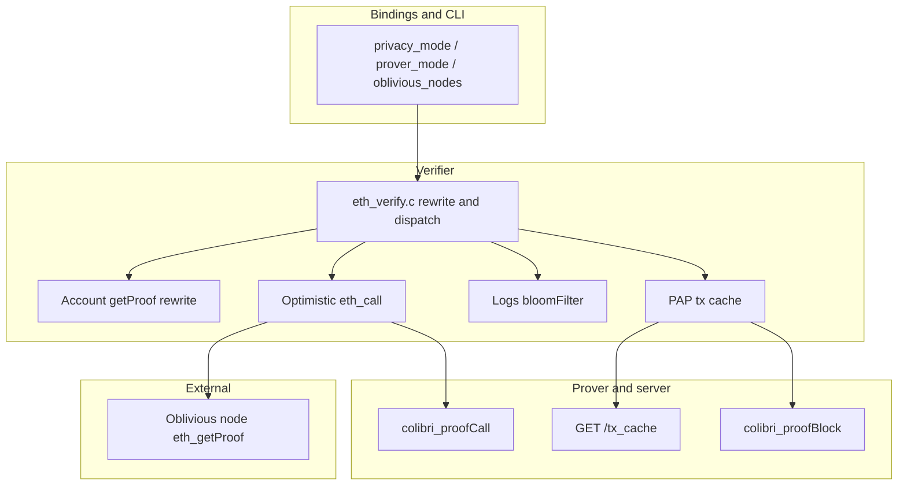
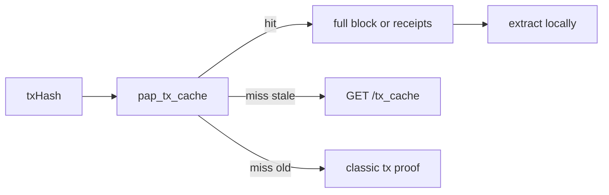

: Ethereum

:: Pragmatic Adaptive Privacy

PAP is Colibri's content-privacy layer for Ethereum RPC. The verifier still cryptographically checks every result; it only changes **what** the RPC provider or prover is allowed to see.

This feature is experimental. The implemented stage is `privacy_mode: basic`. Extra noise (dummy addresses, dummy storage slots, Bloom bit-removal) is the next stage and is not implemented yet.

High-level concept: [Pragmatic Adaptive Privacy (PAP)](https://medium.com/corpus-core-insights/pragmatic-adaptive-privacy-pap-5c6f6080cb1a).

## Enabling

| Switch | Effect |
|--------|--------|
| CMake [`PAP=ON`](../../developer-guide/building/cmake-colibri-lib.md) (default) | Compiles PAP verifier/prover paths (`-DPAP`) |
| [`VERIFY_FLAG_PAP`](../../developer-guide/apis/internal-apis/verify.h.md#verify_flag_t) | Runtime flag (bit 1) |
| Bindings `privacy_mode: basic` | Sets `VERIFY_FLAG_PAP` |
| Bindings `oblivious_nodes` / config `"oblivious"` / CLI `-Z` | Sets `VERIFY_FLAG_OBLIVIOUS` **and** PAP |
| CLI `-P` | Sets `VERIFY_FLAG_PAP` only |
| CMake [`PROVER_CACHE=ON`](../../developer-guide/building/cmake-colibri-lib.md) | Required on the server for `GET /tx_cache` |

## Architecture

The C core does no network I/O. It rewrites methods, emits `data_request_t` entries, and verifies responses. Bindings and the CLI host execute HTTP and route `eth_getProof` to an oblivious node when configured.

### Implementation map

| Area | File |
|------|------|
| Flags | [`verify_flag_t`](../../developer-guide/apis/internal-apis/verify.h.md#verify_flag_t) |
| Method type, payload rewrite, dispatch | [`src/chains/eth/verifier/eth_verify.c`](https://github.com/corpus-core/colibri-stateless/blob/dev/src/chains/eth/verifier/eth_verify.c) |
| PAP request helpers | [`src/chains/eth/verifier/pap_req.c`](https://github.com/corpus-core/colibri-stateless/blob/dev/src/chains/eth/verifier/pap_req.c) |
| Tx / receipt / send | [`src/chains/eth/verifier/verify_pap_tx.c`](https://github.com/corpus-core/colibri-stateless/blob/dev/src/chains/eth/verifier/verify_pap_tx.c) |
| Client tx cache | [`src/chains/eth/verifier/pap_tx_cache.c`](https://github.com/corpus-core/colibri-stateless/blob/dev/src/chains/eth/verifier/pap_tx_cache.c) |
| Server `GET /tx_cache` | [`src/chains/eth/server/handle_tx_cache.c`](https://github.com/corpus-core/colibri-stateless/blob/dev/src/chains/eth/server/handle_tx_cache.c) |
| Optimistic call | [`src/chains/eth/verifier/verify_call.c`](https://github.com/corpus-core/colibri-stateless/blob/dev/src/chains/eth/verifier/verify_call.c) |
| Lazy storage / code | [`src/chains/eth/verifier/call_ctx.c`](https://github.com/corpus-core/colibri-stateless/blob/dev/src/chains/eth/verifier/call_ctx.c) |
| `colibri_proofCall` | [`src/chains/eth/prover/proof_call.c`](https://github.com/corpus-core/colibri-stateless/blob/dev/src/chains/eth/prover/proof_call.c) |
| Bloom variants | [`src/chains/eth/verifier/eth_bloom.c`](https://github.com/corpus-core/colibri-stateless/blob/dev/src/chains/eth/verifier/eth_bloom.c) |
| Local log filter | [`src/chains/eth/verifier/verify_logs_proof.c`](https://github.com/corpus-core/colibri-stateless/blob/dev/src/chains/eth/verifier/verify_logs_proof.c) |
| Hybrid routing | [`bindings/colibri_common.c`](https://github.com/corpus-core/colibri-stateless/blob/dev/bindings/colibri_common.c) |

## Privacy model

Each request is judged on two axes:

- **Transport (T)**: can a provider link the request to a persistent identity (IP, TLS, session)?
- **Content (C)**: can a provider infer intent from the payload (address, calldata, tx hash, log filter)?

PAP in the C core only mitigates **content**. Transport (multi-provider rotation, Tor) is a binding concern and is not implemented here.

Exposure types used below:

- **Identity**: parameters correlate with the caller's own address or activity.
- **Intent**: the request reveals an action that is about to happen (send, swap, approve).
- **Interest**: the request reveals which contracts or state the caller is watching.

Block, gas/fee, uncle, and fully local methods (`eth_chainId`, `web3_sha3`, …) are PAP-uncritical: the parameters are generic or never leave the client.

## Implemented in `privacy_mode: basic`

### Account

**Exposure**: `eth_getBalance` and `eth_getTransactionCount` almost always query the caller's address. The method name itself leaks intent (nonce check ≈ imminent send).

**What the code does**: [`c4_eth_get_prover_payload`](https://github.com/corpus-core/colibri-stateless/blob/dev/src/chains/eth/verifier/eth_verify.c#L271) rewrites the prover request:

| App method | Request sent |
|------------|--------------|
| `eth_getBalance(addr, block)` | `eth_getProof(addr, [], block)` |
| `eth_getTransactionCount(addr, block)` | `eth_getProof(addr, [], block)` |
| `eth_getStorageAt(addr, slot, block)` | `eth_getProof(addr, [slot], block)` |

The provider only sees `eth_getProof`. Contract bytecode for calls is cached under `code_<hash>` ([`call_ctx.c`](https://github.com/corpus-core/colibri-stateless/blob/dev/src/chains/eth/verifier/call_ctx.c), [`eth_account.c`](https://github.com/corpus-core/colibri-stateless/blob/dev/src/chains/eth/verifier/eth_account.c#L170)) and re-checked against `codeHash` from the account proof.

**Not in basic**: address noise (extra dummy accounts in the same batch). `eth_getCode` is not rewritten to `eth_getProof`.

### Call

**Exposure**: calldata encodes the exact function and arguments. The classic prover path runs `eth_createAccessList` first, which leaks the full call to the RPC.

**What the code does**: with PAP, `eth_call`, `eth_estimateGas`, and `colibri_simulateTransaction` become `METHOD_LOCAL` ([`c4_eth_get_method_type`](https://github.com/corpus-core/colibri-stateless/blob/dev/src/chains/eth/verifier/eth_verify.c#L228)) and enter [`verify_call_proof`](https://github.com/corpus-core/colibri-stateless/blob/dev/src/chains/eth/verifier/verify_call.c#L715) without an upfront proof.

1. Load verified account/storage from the local cache (`call_<chain>_<addr>` in [`eth_call_account.c`](https://github.com/corpus-core/colibri-stateless/blob/dev/src/chains/eth/verifier/eth_call_account.c#L194)).
2. Run the EVM locally. Missing slots are fetched lazily ([`call_account_lazy_fetch_storage`](https://github.com/corpus-core/colibri-stateless/blob/dev/src/chains/eth/verifier/call_ctx.c#L118)): `eth_getStorageAt` by default, or `eth_getProof` when oblivious is on.
3. After execution, unverified slots are proven with [`colibri_proofCall`](https://github.com/corpus-core/colibri-stateless/blob/dev/src/chains/eth/prover/proof_call.c#L295), which takes the **already observed** access list. Nobody sees `eth_createAccessList` or the original calldata.
4. If a proven value differs from the cache, the EVM is re-run.

In **hybrid** mode `colibri_proofCall` is not remote-delegated ([`c4_is_remote_delegated_prover_method`](https://github.com/corpus-core/colibri-stateless/blob/dev/bindings/colibri_common.c#L646) only forwards block-header methods). The local sub-prover turns the access list into `eth_getProof` RPCs ([`c4_get_eth_proofs`](https://github.com/corpus-core/colibri-stateless/blob/dev/src/chains/eth/prover/proof_call.c#L211)); with oblivious nodes those go through TEE/ORAM. The remote prover therefore never sees the access list — only a header proof. In **remote** mode the same `colibri_proofCall` is posted to the server, so that server *does* see which slots were read.

**Not in basic**: dummy storage slots mixed into `colibri_proofCall`.

### Logs

**Exposure**: `address` + `topics` often include the user's address (`Transfer`) and the exact protocol being watched.

**What the code does**:

1. [`c4_eth_create_bloomfilter`](https://github.com/corpus-core/colibri-stateless/blob/dev/src/chains/eth/verifier/eth_bloom.c) expands the filter into Bloom **variants** (cartesian product of addresses × topic alternatives).
2. The prover payload replaces `address`/`topics` with `bloomFilter: [...]` ([`eth_verify.c`](https://github.com/corpus-core/colibri-stateless/blob/dev/src/chains/eth/verifier/eth_verify.c#L280)).
3. The logs cache then runs in bloom-only mode ([`logs_cache.c`](https://github.com/corpus-core/colibri-stateless/blob/dev/src/chains/eth/prover/logs_cache.c#L698)): every log whose block Bloom matches is returned.
4. After proof verification, [`verify_logs_proof`](https://github.com/corpus-core/colibri-stateless/blob/dev/src/chains/eth/verifier/verify_logs_proof.c#L135) applies the **original** filter locally.

The provider sees a broader Bloom query, not the exact address/topic list. Filters and subscriptions are not a separate PAP path: prefer local polling via this `eth_getLogs` flow.

**Not in basic**: clearing bits from the Bloom (`bloomNoisePercent`) to widen the match further.

### Transactions

**Exposure**: `eth_getTransactionByHash` / `eth_getTransactionReceipt` name a specific hash — almost always one the user sent or received.

**What the code does** ([`verify_pap_tx`](https://github.com/corpus-core/colibri-stateless/blob/dev/src/chains/eth/verifier/verify_pap_tx.c#L343)):

1. Resolve `txHash → (blockNumber, txIndex)` from the client cache ([`pap_tx_cache.c`](https://github.com/corpus-core/colibri-stateless/blob/dev/src/chains/eth/verifier/pap_tx_cache.c)). On a cold start or stale snapshot (12 s), fetch [`GET /tx_cache`](https://github.com/corpus-core/colibri-stateless/blob/dev/src/chains/eth/server/handle_tx_cache.c#L83) from the prover (needs `PROVER_CACHE` and `VERIFY_FLAG_REMOTE_PROVER`).
2. Request the **whole block**, never the hash:
   - remote: `eth_getBlockByNumber` (CDN-cacheable)
   - hybrid: `colibri_proofBlock` (local sub-prover, not remote-delegated) — [`pap_block_proof_method`](https://github.com/corpus-core/colibri-stateless/blob/dev/src/chains/eth/verifier/verify_pap_tx.c#L119)
3. Extract the transaction locally and check `keccak(raw_tx)` against the requested hash.
4. Receipts use `eth_getBlockReceipts` for that block, then the same index.
5. `eth_sendRawTransaction` / `eth_sendTransaction` go out as ETH RPC; on success the hash is added to the pending list ([`pap_handle_send_tx`](https://github.com/corpus-core/colibri-stateless/blob/dev/src/chains/eth/verifier/verify_pap_tx.c#L320)) so a later lookup refreshes the cache instead of falling through immediately.

Lookups outside the cached window fall back to a classic per-tx proof. That leak is accepted for the long tail.

## Oblivious node

TEE and ORAM are **not** implemented in Colibri. An [Oblivious Labs](https://www.obliviouslabs.com/) (or compatible) node terminates TLS inside a TEE and uses ORAM internally so the node operator cannot see which storage slots were read. Colibri only routes and retries.

**Config**

- JSON / `C4_CONFIG`: `"oblivious": ["https://…"]` ([`libs/curl/http.c`](https://github.com/corpus-core/colibri-stateless/blob/dev/libs/curl/http.c#L110))
- Bindings: `oblivious_nodes` / `obliviousNodes`
- CLI: `-Z <url>` ([`src/cli/verifier.c`](https://github.com/corpus-core/colibri-stateless/blob/dev/src/cli/verifier.c#L284))

A non-empty list sets [`VERIFY_FLAG_OBLIVIOUS`](../../developer-guide/apis/internal-apis/verify.h.md#verify_flag_t) and PAP. Compile-time gate: [`ETH_OBLIVIOUS`](../../developer-guide/building/cmake-colibri-lib.md#eth-options) (default ON).

**Routing**: hosts send only `eth_getProof` to the oblivious URL; everything else stays on normal ETH RPC / prover.

- TypeScript: [`bindings/emscripten/src/http.ts`](https://github.com/corpus-core/colibri-stateless/blob/dev/bindings/emscripten/src/http.ts#L181)
- CLI curl: [`libs/curl/http.c`](https://github.com/corpus-core/colibri-stateless/blob/dev/libs/curl/http.c#L144)

**Call path**: with `VERIFY_FLAG_OBLIVIOUS`, [`call_account_lazy_fetch_storage`](https://github.com/corpus-core/colibri-stateless/blob/dev/src/chains/eth/verifier/call_ctx.c#L118) issues `eth_getProof(addr, [slot], "latest")` instead of `eth_getStorageAt`. A TEE warm-up error (`-32001` / `"data non availability"`) is retried on the **same** node with adaptive backoff.

**Hybrid + PAP + oblivious** is the private `eth_call` setup:

- Hybrid: only the block-header proof comes from the remote prover. `colibri_proofCall` runs locally and expands into `eth_getProof` RPCs.
- PAP: no `eth_createAccessList` and no calldata on any prover.
- Oblivious: those `eth_getProof` calls (lazy fetch **and** local `proofCall`) go through the TEE/ORAM node, so the remote prover never sees the access list.

The RPC provider then sees isolated cryptographic proofs, not the call. First private verified `eth_call`: [Simon Jentzsch, Jun 2026](https://x.com/simon_jentzsch/status/2061834839708270980).

Limits: `eth_getCode` still goes to normal RPC. Without PAP the lazy-fetch switch is not used (`eth_call` is not `METHOD_LOCAL`).

## Hybrid vs remote

| Mode | Flags | PAP tx block proof | Call storage | Prover requests |
|------|-------|--------------------|--------------|-----------------|
| Local | `PAP` | no `/tx_cache` fetch | local / ETH RPC | all local |
| Remote | `PAP` + `REMOTE_PROVER` | `eth_getBlockByNumber` (CDN GET) | ETH RPC or oblivious | all to server |
| Hybrid / light client | `PAP` + `REMOTE_PROVER` + `HYBRID` | `colibri_proofBlock` (local) | ETH RPC or oblivious | only block header methods remote |

[`VERIFY_FLAG_HYBRID`](../../developer-guide/apis/internal-apis/verify.h.md#verify_flag_t) is only safe when the local hybrid prover already verified the header.

## Next privacy stage (not implemented)

`privacy_mode` currently has only `none` and `basic`. The following mitigations from the original design are **not** in the tree:

| Mitigation | Target | Status |
|------------|--------|--------|
| Extra dummy addresses in `eth_getProof` batches | Account identity | not implemented |
| Dummy storage slots in `colibri_proofCall` | Call interest | not implemented |
| Bloom bit-removal / `bloomNoisePercent` | Logs interest | not implemented |
| Multi-provider rotation / Tor (T1/T2) | Transport identity | binding concern, not implemented |

Those would be a later `privacy_mode` beyond `basic`. Remote `eth_newFilter` / `eth_subscribe` also have no PAP path; use local polling through the logs flow above.
