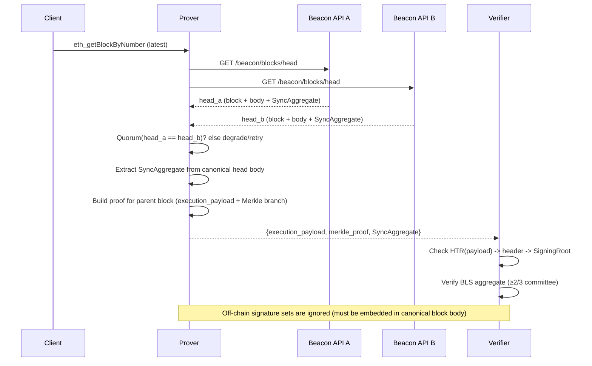

: Ethereum

:: Threat Model

Considering the nature of a verifier, analysing and understanding the limits is critical. While the security of Colibri Stateless is similar to the security of a light client, since it is based on the same foundation, there are specific risks to be aware of. The following expands the classic LightClient threat model with Colibri-specific considerations.

---

## 1. Security of the Sync Committee

### Description

Both Light Clients and Colibri rely on the aggregated BLS signature from a sync committee comprising 512 validators. Given that Ethereum currently has over 1 million active validators, this subset represents a small fraction of the total validator set. The concern arises from the possibility that a compromised or malicious sync committee could sign off on invalid blocks, potentially misleading the client.

### Crypto-Economics

To compromise a client, an attacker would need to produce a valid-looking signature from at least 2/3 of the sync committee (342 out of 512 validators). Given that committee members are sampled randomly from the global validator pool (\~1 million), the attacker would need to control a disproportionately large number of validators to have a meaningful chance of dominating the committee.

| Attacker Control | Expected Committee Members | 2/3 Majority Reached? |
| ---------------- | -------------------------- | --------------------- |
| 10%              | 51                         | ❌                     |
| 33%              | 169                        | ❌                     |
| 66%              | 338                        | ❌ (just under)        |
| 70%              | 358                        | ✅                     |

To reliably reach a 2/3 majority, an attacker would need to control **at least \~70%** of all validators.

* **Required validators**: \~700,000
* **Required ETH**: 700,000 × 32 = **22,400,000 ETH**
* **Estimated cost (at \$3,000/ETH)**: **\$67.2 billion**

This attack would also expose the attacker to:

* **Slashing penalties** (currently only for attestations and block proposals, not yet for sync committee equivocations)
* **Severe market impact**, since acquiring this much ETH would likely skyrocket the price
* **Community countermeasures**, including social recovery or hard forks

🔐 **Conclusion**: A sync committee compromise is considered *economically infeasible* under normal conditions, given the enormous capital requirements and the existential risks for the attacker.

### Mitigation

* **Random Selection**: Sync committee members are selected pseudo-randomly every 256 epochs (\~27 hours), making it statistically improbable for an attacker to consistently control the committee.
* **Economic Incentives**: Validators have significant ETH staked and are disincentivized from misbehavior.
* **Future Change (EIP-7657)**: Once activated, double-signing in the sync committee becomes slashable, significantly strengthening the crypto-economic security for Colibri and Light Clients alike.

---

## 2. Finality During LightClientUpdates

### Description

LightClientUpdates include both an `attestedHeader` and a `finalityHeader`. The proof for the `nextSyncCommittee` is based on the `attestedHeader`, which may not be finalized at the time of the update. This raises concerns about reliability if the `attestedHeader` is later reorged out.

### Mitigation

* **Temporal Stability**: The `nextSyncCommittee` is fixed per period (\~27 hours), reducing reorg risk.
* **Finality Proofs**: Finalized headers eventually override optimistically chosen ones.
* **Economic Deterrents**: Validators remain disincentivized from equivocation.

---

## 3. Long Chain Attacks

### Description

Long-range attacks involve adversaries creating an alternative chain that diverges from the main chain, potentially deceiving light clients that have been offline for extended periods. This is a known vulnerability in proof-of-stake systems, especially concerning nodes that lack recent state information.

### Crypto-Economic Risk Analysis

Long-range or “long chain” attacks exploit the fact, that in Proof-of-Stake systems, old validators can sign alternative chains even if they no longer have any stake locked. Unlike short-term attacks on sync committees, long-range attacks don’t require control over live validators – they rely on historical keys and inactive signers.

This makes the **cost** of launching such an attack theoretically **much lower**, but introduces a different class of security assumption: **weak subjectivity**.

### Weak Subjectivity Period

A light client must regularly sync to a trusted checkpoint within the so-called **weak subjectivity period** (WSP). The WSP is the maximum safe offline time before finality guarantees weaken. If a client has been offline longer than the WSP, it can no longer be certain which chain is canonical, unless it verifies the root against a trusted source.

> ⏳ The length of the WSP depends on validator churn and activity, but is typically between **2 to 4 months** on Ethereum mainnet.

See the detailed analysis by Runtime Verification:
📄 [Weak Subjectivity Analysis](https://github.com/runtimeverification/beacon-chain-verification/blob/master/weak-subjectivity/weak-subjectivity-analysis.pdf)

### Attack Strategy

An attacker could attempt to:

1. Restore old validator keys (from backups or leaks)
2. Construct a valid-looking but non-canonical fork starting from a historic block
3. Use these old keys to sign a fork with "finalized" headers
4. Trick clients that haven’t synced recently and have no fresh trusted checkpoint

**Attack Cost**

* **No stake required**: Validators don’t need to have any ETH at stake; only old keys.
* **Infrastructure cost**: The attacker must simulate a chain many epochs long, including all block proposals and attestations.
* **Risk of detection**: Honest full nodes and checkpoint providers will reject the fork, so the attack only works against **isolated or offline clients**.
* **Long duration**: Building a convincing fork over months of slots is computationally expensive and non-trivial.

### Mitigation

* **Weak Subjectivity Checkpoints**: Colibri and Light Clients must be configured with trusted block hashes (Checkpoints) to anchor verification.
* **Checkpoint Providers**: External sources can provide safe synchronization points.
* **Community Consensus**: Social recovery (hard forks) in extreme attack scenarios.

---

## 4. Colibri-Specific Considerations

Unlike standard Light Clients, Colibri does **not** sync via gossip or LightClientUpdates. Instead, it:

* Fetches blocks on-demand via Beacon APIs.
* Verifies them using the **SyncAggregate** (up to 512 signatures from the next block’s BlockBody).

This means that the **`is_better_update` logic has already been applied by consensus** before Colibri sees the signatures. Colibri therefore only validates a single aggregate per block — it never needs to resolve competing updates itself.

### Specific Risks

| Risk                               | Today                                                                       | Mitigation                                                                         | With EIP-7657                           |
| ---------------------------------- | --------------------------------------------------------------------------- | ---------------------------------------------------------------------------------- | --------------------------------------- |
| **SyncCommittee Double-Signature** | Not slashable → attacker with >2/3 control could equivocate without penalty | Evidence collection: Colibri can store conflicting signatures for future reporting | Slashable → attackers risk losing stake |
| **API Censorship / Withholding**   | Single Beacon API could deny service or serve stale data                    | Use multiple APIs, consistency checks across sources, retry logic                  | Same mitigations remain                 |
| **Force-Update Risk**              | If no finality, Colibri must accept optimistic headers to progress          | Mark optimistic headers clearly; never treat them as final until confirmed         | Same mitigations remain                 |

---

## 5. Reorgs and SyncAggregate Risk

### Description

Reorganizations (reorgs) occur when the canonical chain switches to an alternative fork, causing previously seen blocks to be orphaned. Under Ethereum PoS (Gasper), short 1-slot reorgs can happen due to timing and network variance; deeper reorgs (≥2 slots) are rare and usually indicate unusual network conditions or misconfigurations.

### How Colibri uses SyncAggregate

For latest queries, Colibri obtains the head block, extracts its `SyncAggregate`, then proves the parent block by computing the parent’s `execution_payload` `hash_tree_root` and verifying via the Merkle branch up to the parent header. The verifier checks the BLS aggregate against the `SigningRoot` and confirms a ≥2/3 sync committee majority.

### When can a valid aggregate point to a non-canonical block?

* A `SyncAggregate` included in a canonical head for slot n attesting to the parent block (slot n-1) will only exist on-chain if the chain actually extended that parent. Therefore, ordinary 1-slot reorgs typically do not embed aggregates for the orphaned block.
* For the verifier to accept a block that later becomes non-canonical despite a valid aggregate, the reorg depth must be ≥2 (the chain first extended the parent, then later reorged deeper).

### Risk quantification (order-of-magnitude)

* Let p1 be the probability of a 1-slot reorg and p≥2 the probability of a reorg with depth ≥2. The verifier’s exposure is approximately p≥2.
* Empirically, documented deep reorgs on the Beacon chain are very rare; notable incidents (e.g., a 7-block reorg in May 2022 during stabilization) are outliers. Public analyses indicate that under normal network conditions, depth ≥2 reorgs are extremely uncommon on mainnet.
* Empirically, 1-slot reorgs are observed on mainnet with a cadence of roughly every 1–2 hours; see [Etherscan Forked Blocks (Reorgs)](https://etherscan.io/blocks_forked). Due to the protocol placement of `SyncAggregate` in the next block’s body, an orphaned block from a 1-slot reorg will not have its `SyncAggregate` included in any canonical block. Therefore, a prover sourcing aggregates from the canonical head does not accept orphaned 1-slot blocks. The only exception would be an adversary who collects ≥2/3 sync-committee signatures off-chain (never on-chain) and assembles an aggregate that the prover did not extract from a canonical block.
* Adversarially forcing a canonical block to carry a valid sync aggregate for a block that will later be orphaned requires either:
  * controlling two or more consecutive slots on a minority fork and eclipsing ≥2/3 of the 512 sync-committee participants during that window; or
  * causing a large-scale network partition that isolates ≥2/3 of the sync committee. Both are operationally daunting; the latter resembles the capability to control or isolate the majority of committee participants for a slot.

References: [EIP-7657 (Slash sync committee equivocations)](https://eips.ethereum.org/EIPS/eip-7657), example incident: [Beacon chain 7-block reorg (May 2022)](https://de.cointelegraph.com/news/ethereum-beacon-chain-experiences-7-block-reorg-what-s-going-on).

### Mitigations

* For high-assurance use cases: verify against finalized checkpoints (FFG finality) instead of latest.
* BlockTag selection expresses acceptable reorg risk: `latest` (highest liveness, non-zero reorg risk), `justified` (reduced risk), `finalized` (zero reorg risk), or an explicit block number/hash.
* For near-real-time queries: add a safety delay of k slots (e.g., 2–4) before accepting a block as stable; this reduces exposure to ≥2-slot reorgs.
* Multiple Beacon APIs help detect divergent heads on the prover side. The verifier itself does not query Beacon APIs; it relies on checkpoints and proofs provided by the prover. Under optimistic heads, Colibri’s exposure is comparable to that of full Beacon clients and other light clients given the same head.
* Persist conflicting aggregates as evidence for future reporting; once EIP-7657 activates, equivocations become slashable.

#### BlockTag trade-offs

| BlockTag   | Reorg risk                                     | Latency                 | Notes                                                     |
| ---------- | ----------------------------------------------- | ----------------------- | --------------------------------------------------------- |
| `latest`   | Non-zero (exposure ≈ p≥2; reduce with k-slot)   | Lowest                  | Optimistic head; subject to non-final reorgs              |
| `justified`| Very low                                        | Low                     | Anchored at justified checkpoint                          |
| `finalized`| Zero                                            | Highest (≥2 epochs)     | Requires FFG finality                                     |
| number/hash| Depends on the referenced block’s finality      | N/A                     | If finalized: zero; if recent non-final: as above         |

### Operational guidance

* Provide a “strict mode” that only accepts finalized blocks.
* Default “fast mode” can accept latest with a small slot delay and surface an “optimistic” status until finality.

#### Aggregate sourcing policy (Prover)

* Extract `SyncAggregate` exclusively from the canonical head block body as returned by Beacon APIs; never accept off-chain collected signature sets.
* Use multiple Beacon API providers and require a quorum (e.g., 2-of-3) agreement on the head before extracting aggregates; otherwise, retry or degrade to `justified`/`finalized`.
* Enforce slot-consistency checks: aggregate slot = head slot, aggregate target = parent of the proved block.
* Optionally require a small k-slot delay before using aggregates to further reduce exposure to ≥2-slot reorgs.

---

## 6. Conclusion

* **Colibri vs. Light Clients**: Both rely on the same sync committee assumption (<1/3 byzantine). Colibri’s difference is the use of `SyncAggregate` from the block body rather than `LightClientUpdate`. This means Colibri is slightly simpler (no `is_better_update` handling), but equally exposed to the fundamental security assumption.
* **Main Gap (today)**: Lack of slashing for sync committee equivocations.
* **Future (with EIP-7657)**: Colibri achieves parity with classical Light Clients in crypto-economic security, with the added operational simplicity of on-demand verification.

